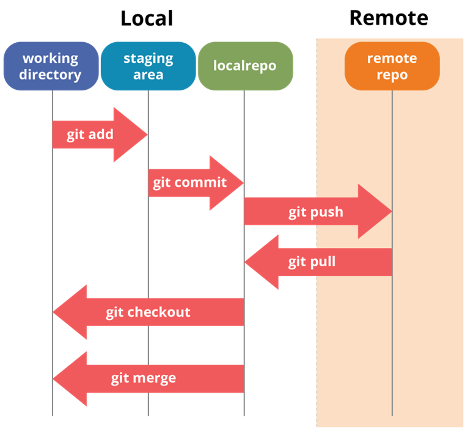

# Git : Utilisation en Local

Git est avant tout un outil conçu pour être utilisé localement, c'est-à-dire sur votre propre ordinateur. Il vous permet de gérer l'historique des modifications de vos projets, de revenir à des versions antérieures en cas de besoin, et de collaborer efficacement avec d'autres développeurs.

## Principe de fonctionnement

- **Travail en local :** Vous travaillez dans un répertoire ou dossier de travail (appelé "working directory"). C'est ici que vous créez, modifiez et supprimez des fichiers.
- **Initialisation du suivi de version :** Lorsque vous initialisez Git dans un projet, un dossier caché `.git` est créé. Ce dossier contient toutes les informations nécessaires au suivi des modifications de votre projet. Git crée également deux espaces virtuels au sein de votre répertoire de travail :
  - **Zone de transit ("staging area") :** C'est un espace intermédiaire où vous préparez les modifications que vous souhaitez inclure dans le prochain commit. Vous ajoutez des fichiers à la zone de transit pour indiquer à Git que vous souhaitez enregistrer leurs modifications.
  - **Dépôt local ("local repository") :** C'est l'endroit où Git stocke l'historique complet de votre projet, y compris toutes les versions de vos fichiers et les messages de commit associés. Lorsque vous effectuez un commit, les modifications de la zone de transit sont enregistrées dans le dépôt local.
- **Dépôt distant ("remote repository") :** Il s'agit d'une copie de votre dépôt local hébergée sur un serveur distant, comme GitHub ou GitLab. Vous pouvez utiliser le dépôt distant pour partager votre travail avec d'autres développeurs, sauvegarder votre projet en ligne, ou collaborer sur le même projet avec plusieurs personnes. Nous verrons comment utiliser les dépôts distants plus tard.



## Plus en détail : le répertoire `.git`

Lorsque vous initialisez un dépôt Git, un sous-dossier caché `.git` est créé. Ce répertoire est essentiel au fonctionnement de Git et contient les éléments suivants :

- **`config/` :** Contient la configuration spécifique à l'utilisateur et au dépôt Git, comme votre nom, votre adresse e-mail et d'autres paramètres.
- **`objects/` :** Stocke tous les objets Git, qui sont les éléments fondamentaux du système de gestion de versions. Ces objets incluent les commits, les tags, les arbres (qui représentent la structure des dossiers) et les blobs (qui contiennent le contenu des fichiers).
- **`refs/heads/` :** Contient des pointeurs vers les commits de chaque branche locale. Les branches vous permettent de travailler sur différentes versions de votre projet en parallèle.
- **`logs/` :** Stocke l'historique des opérations effectuées dans le dépôt, comme les commits, les changements de branche, etc.
- **`refs/remotes/` :** Contient des pointeurs vers les états des branches suivies dans les dépôts distants. Cela permet à Git de savoir quelles branches locales correspondent à quelles branches sur le dépôt distant.
- **`index` :** C'est un fichier temporaire qui prépare les données pour le prochain commit. Il contient la liste des fichiers qui seront inclus dans le commit et leurs modifications.
- **`HEAD` :** Un pointeur spécial qui indique la branche courante ou le commit actuel sur lequel vous travaillez.

## Configuration de Git

### Via le terminal (Git Bash)

1. **Définir votre identité pour les commits :**

   ```bash
   git config --global user.name "Votre Prénom Votre Nom"
   git config --global user.email "votre.email@example.com"
   ```

   > **Remarque :** Veillez à ce que le nom et l'adresse e-mail configurés ici correspondent à ceux que vous utiliserez sur des plateformes comme GitHub ou GitLab. Si les informations diffèrent, vos commits pourraient ne pas être correctement associés à votre compte sur ces plateformes, ce qui peut poser des problèmes de suivi des contributions.

2. **Initialiser un dépôt local et vérifier son état :**

   ```bash
   cd chemin_vers_votre_projet
   git init
   git status
   ```

## Utilisation de Git par les commandes Bash

Une fois Git configuré, vous pouvez commencer à l'utiliser pour gérer les versions de votre code via le terminal (Git Bash). Voici les commandes de base que vous utiliserez fréquemment :

1. **Initialiser un dépôt Git :**

   Pour commencer à utiliser Git dans un projet existant, naviguez vers le répertoire du projet et exécutez :

   ```bash
   git init
   ```

   Cela crée un dépôt Git local dans le répertoire courant en ajoutant un sous-dossier caché `.git`. Ce dépôt suivra les modifications apportées aux fichiers du projet.

2. **Cloner un dépôt existant :**

   Si vous souhaitez travailler sur un projet existant qui est hébergé sur une plateforme comme GitHub ou GitLab, vous pouvez cloner le dépôt avec :

   ```bash
   git clone url_du_dépôt
   ```

   Cela crée une copie locale du dépôt distant, incluant tout l'historique des commits, les branches, etc.

3. **Ajouter des fichiers à la zone de transit (staging area) :**

   Avant de sauvegarder vos modifications dans un commit, vous devez ajouter les fichiers modifiés à la zone de transit :

   ```bash
   git add nom_du_fichier
   ```

   Pour ajouter tous les fichiers modifiés, utilisez :

   ```bash
   git add .
   ```

   Cette commande prépare les fichiers pour le commit en les ajoutant à la zone de transit.

4. **Faire un commit :**

   Un commit est une "photo" ou un instantané du projet à un moment donné. Il enregistre les modifications apportées aux fichiers dans la zone de transit. Chaque commit doit représenter une petite étape logique dans le développement du projet, comme la correction d'un bug ou l'ajout d'une fonctionnalité.

   Pour créer un commit, exécutez :

   ```bash
   git commit -m "Message court et concis décrivant la modification"
   ```

   Le message de commit doit être bref et explicite, indiquant clairement ce qui a été modifié. Par exemple, `git commit -m "Correction d'un bug dans l'authentification utilisateur"`.

   > **Conseil :** Un bon message de commit aide à comprendre l'historique du projet et à identifier rapidement les changements apportés.

---

## Utilisation de Git avec des outils graphiques

Bien que Git puisse être utilisé entièrement via la ligne de commande, de nombreux outils graphiques facilitent son utilisation, en particulier pour les débutants ou ceux qui préfèrent une interface visuelle. Voici quelques exemples d'outils populaires :

- **Visual Studio Code (VSCode) :** VSCode intègre Git de manière native, offrant une interface graphique conviviale pour gérer les commits, les branches, les fusions, etc. Vous pouvez également installer des extensions comme GitLens pour obtenir des informations supplémentaires sur l'historique de votre projet.


- **PyCharm :** PyCharm propose également une intégration Git robuste, avec des fonctionnalités similaires à celles de VSCode.

- **Autres IDEs :** De nombreux autres environnements de développement intègrent Git, tels qu'IntelliJ IDEA et Eclipse.
- **Clients Git dédiés :** Il existe également des clients Git dédiés comme GitKraken, Sourcetree et TortoiseGit, qui offrent une interface graphique complète pour gérer vos dépôts Git.


## Git Cheat Sheet

Voici quelques commandes essentielles à garder sous la main :

- Cloner un dépôt : `git clone url_du_dépôt`
- Ajouter tous les fichiers modifiés à la zone de transit : `git add .`
- Committer les changements : `git commit -m "message de commit"`
- Pousser les changements vers le dépôt distant : `git push`
- Mettre à jour le répertoire local avec les changements du dépôt distant : `git pull`


## Conclusion

Git est un outil puissant qui peut grandement améliorer votre flux de travail en vous permettant de suivre les modifications de votre projet, de collaborer avec d'autres développeurs et de protéger votre travail contre les pertes de données. Que vous préfériez utiliser la ligne de commande ou une interface graphique, Git offre la flexibilité nécessaire pour s'adapter à vos besoins et à votre façon de travailler.

N'hésitez pas à explorer les ressources en ligne et à expérimenter avec Git pour découvrir tout son potentiel !
