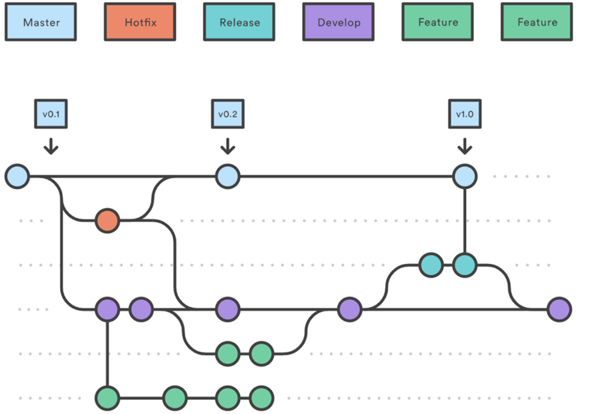

⏱️ **Durée estimée :** 35 minutes (lecture + pratique)
📋 **Prérequis :** Bases de Git, expérience avec les commits
🎯 **Objectifs :** 
- Comprendre le concept et l'utilité des branches
- Apprendre la stratégie Git Flow pour les projets
- Maîtriser les commandes de branchement essentielles
- Savoir organiser son workflow de développement

**TL;DR :** Ce chapitre présente les stratégies de branchement pour organiser efficacement le développement collaboratif.
# Stratégie de Gestion des Branches dans Git/GitHub

## Introduction

Imaginez que Git est un arbre avec plusieurs branches. Chaque branche représente une version différente de votre projet, vous permettant d'explorer de nouvelles idées, de corriger des erreurs ou d'ajouter des fonctionnalités sans perturber le tronc principal (la branche principale). C'est comme avoir plusieurs brouillons de votre travail, chacun dédié à un aspect spécifique.

## Comprendre les branches dans Git

### Définition d'une branche

Une branche dans Git est une copie indépendante de votre projet à un moment donné. Vous pouvez créer autant de branches que nécessaire, chacune servant à un objectif précis.

### Utilité des branches

Les branches sont essentielles pour :

* **Développement isolé:** Travailler sur de nouvelles fonctionnalités ou des corrections de bugs sans affecter la version stable de votre projet.
* **Collaboration:** Permettre à plusieurs personnes de travailler simultanément sur le même projet sans se gêner mutuellement.
* **Expérimentation:** Tester de nouvelles idées ou approches sans risquer de compromettre le code principal.

## Stratégie de branches proposée

### 1. Structure des branches

* **`main` (ou `master`) :** La branche principale, représentant la version stable et prête à être utilisée de votre projet.
* **`develop` :** La branche de développement principale, où les nouvelles fonctionnalités sont intégrées et testées avant d'être fusionnées dans `main`.
* **Branches de fonctionnalités (`feature/*`) :** Branches créées à partir de `develop` pour développer des fonctionnalités spécifiques.
* **Branches de correctifs (`hotfix/*`) :** Branches créées à partir de `main` pour corriger rapidement des bugs critiques en production.

### 2. Workflow de développement

1. **Développement de fonctionnalités :**
   * Créez une nouvelle branche à partir de `develop` pour chaque nouvelle fonctionnalité (par exemple, `feature/new_functionality`).
   * Développez et testez votre fonctionnalité sur cette branche.
   * Une fois la fonctionnalité terminée, fusionnez-la dans `develop` à l'aide d'une "pull request" (demande de fusion).

2. **Intégration et déploiement :**
   * Lorsque `develop` est stable et prêt pour le déploiement, fusionnez-le dans `main`.
   * Déployez la nouvelle version de votre projet à partir de `main`.

3. **Corrections urgentes :**
   * Si un bug critique est découvert en production, créez une branche `hotfix/*` à partir de `main`.
   * Corrigez le bug sur cette branche.
   * Fusionnez la branche de correctif dans `main` et, si nécessaire, dans `develop`.
   * Déployez la correction en production.

### 3. Gestion des merges et Pull Requests

* **Merge (fusion) :** L'action de combiner les modifications d'une branche dans une autre.
* **Pull Request (demande de fusion) :** Un mécanisme permettant de proposer des modifications à une branche et de solliciter une revue de code avant la fusion.

## Comprendre et gérer les conflits dans Git

### Qu'est-ce qu'un conflit ?

Un conflit dans Git se produit lorsque deux branches ont modifié la même partie d'un fichier de manière incompatible. Git ne peut pas décider automatiquement quelle version est la bonne, et vous devez donc résoudre le conflit manuellement.

### Dans quelles circonstances un conflit arrive-t-il ?

Les conflits surviennent généralement lorsque :

* Deux branches modifient la même ligne de code dans le même fichier.
* Une branche modifie un fichier qu'une autre branche a supprimé.
* Deux branches ajoutent un nouveau fichier avec le même nom.

En regardant le schéma, on peut imaginer des conflits possibles lorsque :

* On fusionne une branche `feature` dans `develop`, si des modifications ont été faites sur les mêmes lignes de code dans les deux branches.
* On fusionne `develop` dans `main`, si des modifications ont été faites sur `main` depuis la création de la branche `develop`.
* On fusionne un `hotfix` dans `develop`, si le bug corrigé a aussi été traité différemment sur `develop`.

### Comment éviter les conflits ?

* **Communication :** Discutez avec votre équipe des parties du projet sur lesquelles vous travaillez pour éviter de modifier les mêmes fichiers en même temps.
* **Branches à jour :** Avant de commencer à travailler sur une nouvelle fonctionnalité ou un correctif, mettez à jour votre branche avec les dernières modifications de la branche parente (`develop` ou `main`). Cela réduit les risques de conflits lors de la fusion ultérieure.
* **Commits fréquents et petits :** Faites des commits réguliers et de petite taille, chacun représentant une modification logique. Cela facilite la compréhension de l'historique du projet et la résolution des conflits éventuels.

### Comment résoudre un conflit ?

1. **Identifier le conflit :** Git vous indiquera les fichiers en conflit lors d'une tentative de fusion. Vous verrez des marqueurs spéciaux dans ces fichiers (`<<<<<<<`, `=======`, `>>>>>>>`) qui délimitent les différentes versions du code.
2. **Examiner les modifications :** Ouvrez les fichiers en conflit dans votre éditeur de texte ou votre IDE. Analysez les différentes versions du code et décidez quelles modifications vous souhaitez conserver.
3. **Modifier le fichier :** Supprimez les marqueurs de conflit et modifiez le code pour obtenir la version finale souhaitée.
4. **Ajouter et commiter :** Une fois le conflit résolu, ajoutez le fichier modifié à la zone de transit (`git add nom_du_fichier`) et faites un commit (`git commit`) pour enregistrer la résolution.

### Outils pour faciliter la résolution des conflits

* **Votre IDE :** La plupart des IDE modernes (comme VSCode ou PyCharm) offrent des outils visuels pour comparer les différentes versions du code et faciliter la résolution des conflits.
* **Outils de fusion dédiés :** Il existe des outils externes comme KDiff3, Meld ou Beyond Compare qui peuvent vous aider à visualiser et à résoudre les conflits de manière plus avancée.

## Conclusion

L'utilisation d'une stratégie de branches claire et cohérente est essentielle pour organiser efficacement le développement de vos projets scientifiques. Elle favorise la collaboration, facilite la gestion des modifications et garantit la stabilité de votre code. La gestion des conflits fait partie intégrante de ce processus, et en comprenant comment les prévenir et les résoudre, vous pourrez maintenir un flux de travail fluide et productif.

<!-- ## Suggestions d'améliorations

* **Exemples concrets :** Illustrez les concepts avec des exemples liés à des projets scientifiques (analyse de données, simulations, etc.).
* **Schémas supplémentaires :** Ajoutez des diagrammes pour visualiser les différentes étapes du workflow de développement et la gestion des branches.
* **Liens vers des ressources :** Fournissez des liens vers des tutoriels ou des articles pour approfondir certains aspects (résolution de conflits, bonnes pratiques, etc.).
