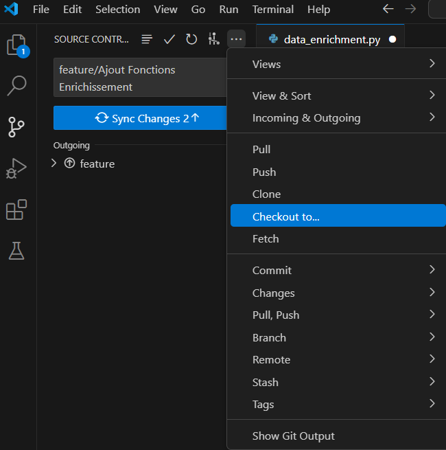

L'objectif de cette section est de présenter les étapes pour commencer un nouveau projet/simulateur lié au serveur GitLab

## Création d'un projet sur GitLab

1. Depuis la page d'accueil, sur la barre d'outils à gauche, cliquez sur "Projets"
2. En haut à droite, cliquez sur le bouton bleu "Nouveau projet"
3. Partons de l'option "Créer un projet vide" pour ce tutoriel
4. Choisissez un nom pour le projet. Jusqu'à présent les noms de projets sont en anglais : Centrifugal pump, Mixing, Reactor Volume, etc.
5. "Niveau de visibilité : Privé". Dans cette configuration, l'accès au projet doit être donné explicitement à chaque utilisateur.
6. "Configuration du projet : Initialiser le dépôt avec un README"

## Lien entre un dépôt local et le serveur GitLab

Avant de commencer à coder les script python, il faut créer un dossier qui répertorie tous les fichiers du simulateur et qui réalise un suivi de modification entre votre ordinateur (en réseau local) et le serveur GitLab.

1. Il faut créer un dossier de dépôt (ici appelé "INEVO_depot") dans un répertoire **non synchronisé** avec OneDrive

   Par exemple : C:\\Utilisateurs\\Trigramme\\INEVO_depot
2. Dans ce dossier de dépôt, créez un dossier pour le simulateur à développer. Par exemple :

   C:\\Utilisateurs\\Trigramme\\INEVO_depot\\Crystallization

Revenons sur la page INEVO sur GitLab,

1. Depuis la page d'accueil, cliquez sur "Projets" dans la barre d'outils à gauche
2. Sélectionnez le nouveau projet créé. Cela nous emmène vers la page avec toutes les informations du projet
3. A droite, cliquez sur le bouton bleu "Code". Les options affichées servent à cloner le projet du serveur GitLab vers le dossier créé dans l'étape 2 ci-dessus.
4. Le chemin le plus simple est sur l'option "Ouvrir dans votre IDE". Sélectionnez l'environnement qui vous convient avec l'option HTTPS
5. Un nouvel onglet s'ouvre et vous demande de choisir le dossier à attacher au serveur GitLab

## Votre premier script python synchronisé avec GitLab

Si vous utilisez **Visual Studio Code (VS Code)** :

1. Ouvrez le dossier du simulateur dans VSCode (option "Explorer" à gauche)
2. Créez un nouveau fichier .py
3. Ecrivez votre première fonction dans ce fichier .py
4. Sélectionnez l'option "Source Control" dans le menu à gauche. Dans ce nouveau menu, vous pourrez réaliser vos "commit" vers le serveur GitLab (suggestion : Modifiez peu à peu votre code avec des "commit" pour un meilleur suivi des modifications)
5. Comme montré dans l'image ci-dessous, cliquez sur "..." et ensuite "Checkout to" pour connecter vos modifications avec une branche spécifique du projet
6. Il est recommandé de réaliser les modifications sur une branche "feature", par exemple. Il suffit de cliquez sur "Create new branch" après l'étape 5

{width="385" height="388"}

Installez l'extension "Git Graph" sur VS Code pour mieux suivre (visuellement) les modifications entre les différentes branches du simulateur