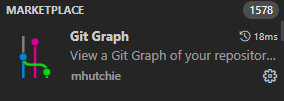

Git est un outil qui s'utilise d'abord en local, c'est à dire sur son ordinateur.

# Principe de fonctionnement

- On travaille en local (sur son ordinateur) dans le répertoire/dossier de travail (« working directory »)
- On initialise le suivi de version par git, créant deux espaces virtuels dans le répertoire de travail (création d’un dossier .git dans le dossier de travail) :
  * Zone de transit (« staging area ») : les fichiers ajoutés dans ce groupe seront suivis pour leurs modifications
  * Dépôt local (« Local repository ») : lorsqu’on engage (commit) des modifications dans le dépôt local, on enregistre les modifications faites par les fichiers désignés dans la zone de transit
  * Dépôt distant (« Remote repository ») : nous verrons son utilisation plus tard avec GitLab

{width="515" height="483"}

# Plus en détail

## Répertoire `.git`

Quand on initialise un dépôt Git, un sous-dossier caché `.git` est créé. Voici ce qu'il contient :

- `config/` : Configuration de l'utilisateur et du dépôt Git.
- `objects/*` : Tous les objets Git (commits, tags, arbres, blobs) sont ici.
- `refs/heads/*` : Pointeurs vers les commits de chaque branche locale.
- `logs/*` : Historique des opérations réalisées dans le dépôt.
- `refs/remotes/*` : Pointeurs vers les états des branches suivies dans les dépôts distants.
- `index` : Prépare les données pour le prochain commit.
- `HEAD` : Pointeur vers la branche courante ou le commit actuel.

## Configuration de Git

### Via le terminal (git bash) :

1. Définir son identité pour les commits :

`git config --global user.name « FirstName LastName »`

`git config --global user.email «` your_email@email_provider.com`»`

2. Initialiser un dépôt local et vérifier son état :

`cd &path_of_your_repo&`

`git init`

`Git status`

### Avec un outil intégré

#### VSCode

Visual Studio Code (VSCode) est doté d'un support Git intégré qui facilite le contrôle de version pour les développeurs. Voici comment configurer et utiliser Git dans VSCode :

1. **Ouverture d'un projet avec VSCode :**
   - Lancez VSCode.
   - Ouvrez le dossier de votre projet en utilisant `File > Open Folder`.
2. **Initialisation d'un dépôt Git :**
   - Ouvrez le terminal intégré avec `` Ctrl+` `` (la touche backtick).
   - Tapez `git init` pour initialiser un nouveau dépôt Git.
   - Si le dossier est déjà un dépôt Git, VSCode le reconnaîtra automatiquement.
3. **Gestion des changements :**
   - Les fichiers modifiés seront marqués dans l'explorateur de fichiers.
   - Pour ajouter des fichiers à la zone de transit (staging area), cliquez sur le signe `+` à côté du fichier dans l'onglet `Source Control` ou utilisez le terminal avec la commande `git add <nom_du_fichier>`.
4. **Commit des modifications :**
   - Saisissez un message de commit dans la zone de texte en haut de l'onglet `Source Control`.
   - Appuyez sur `Ctrl+Enter` pour commettre les modifications.
   - Vous pouvez aussi faire un commit via le terminal en utilisant `git commit -m "Votre message de commit"`.
5. **Gestion des branches :**
   - Pour créer ou changer de branche, utilisez l'interface en bas de la fenêtre de VSCode ou ouvrez la palette de commandes avec `Ctrl+Shift+P` et tapez `Git: Create Branch`.
6. **Synchronisation avec un dépôt distant :**
   - Cliquez sur le bouton `Sync Changes` dans l'onglet `Source Control` pour pousser vos commits vers le dépôt distant et pour tirer les changements depuis celui-ci.
7. **Résolution des conflits :**
   - En cas de conflit de fusion, VSCode met en évidence les différences et vous permet de choisir entre différentes options pour les résoudre.

VSCode offre également des extensions Git qui peuvent améliorer votre expérience, comme GitLens, qui enrichit l'interface utilisateur de VSCode avec des informations sur Git.

Extensions conseillées : 

#### PyCharm

- PyCharm a une intégration Git robuste. Pour l'utiliser :
  1. Ouvrez le projet dans PyCharm.
  2. Allez dans `VCS` -\> `Enable Version Control Integration`, puis sélectionnez Git.
  3. Utilisez l'onglet `Version Control` en bas pour committer, pousser, et gérer les branches.

#### Autres IDEs

- **IntelliJ IDEA :** Utilisez le panneau 'Version Control' pour gérer vos dépôts Git.
- **Eclipse :** Installez le plugin 'EGit' pour intégrer la gestion Git.
- **GitKraken :** Une interface graphique pour gérer les dépôts sans utiliser la ligne de commande.

## Git Cheat Sheet

Voici quelques commandes utiles à garder sous la main :

- Cloner un dépôt : `git clone url_du_dépôt`
- Ajouter tous les fichiers modifiés à la zone de transit : `git add .`
- Committer les changements : `git commit -m "message de commit"`
- Pousser les changements vers le dépôt distant : `git push`
- Mettre à jour le répertoire local avec les changements du dépôt distant : `git pull`

