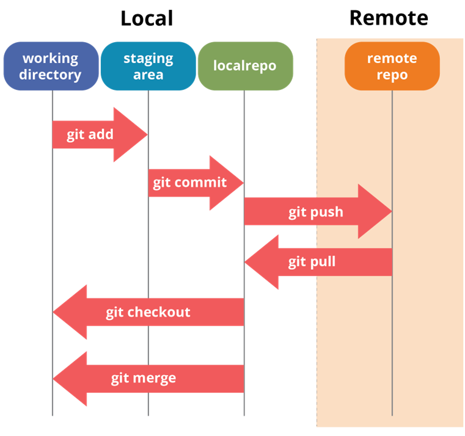
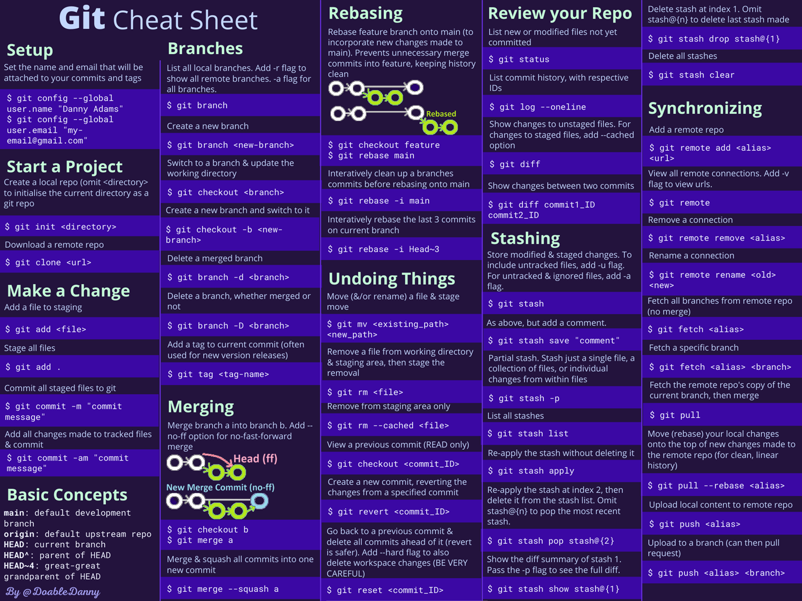

# Git : Utilisation en Local

Git est avant tout un outil conçu pour être utilisé localement, c'est-à-dire sur votre propre ordinateur.

## Principe de fonctionnement

- **Travail en local :** Vous travaillez dans un répertoire ou dossier de travail (appelé "working directory").
- **Initialisation du suivi de version :** Lorsque vous initialisez Git dans un projet, deux espaces virtuels sont créés au sein du répertoire de travail, avec la création d'un dossier caché `.git` :
  - **Zone de transit ("staging area") :** C'est ici que vous placez les fichiers que vous souhaitez préparer pour le prochain commit. Les fichiers ajoutés à cette zone sont suivis pour les modifications.
  - **Dépôt local ("local repository") :** Une fois que vous effectuez un commit, les modifications des fichiers dans la zone de transit sont enregistrées ici.
  - **Dépôt distant ("remote repository") :** Les modifications locales peuvent être envoyées vers un dépôt distant pour sauvegarde ou collaboration avec d'autres développeurs. Nous explorerons son utilisation plus tard avec des plateformes comme GitLab.



## Plus en détail : le répertoire `.git`

Lorsque vous initialisez un dépôt Git, un sous-dossier caché `.git` est créé. Ce répertoire contient les éléments suivants :

- **`config/` :** Contient la configuration spécifique à l'utilisateur et au dépôt Git.
- **`objects/` :** Tous les objets Git (commits, tags, arbres, blobs) sont stockés ici.
- **`refs/heads/` :** Contient des pointeurs vers les commits de chaque branche locale.
- **`logs/` :** Stocke l'historique des opérations effectuées dans le dépôt.
- **`refs/remotes/` :** Pointeurs vers les états des branches suivies dans les dépôts distants.
- **`index` :** Prépare les données pour le prochain commit.
- **`HEAD` :** Pointeur vers la branche courante ou le commit actuel.

## Configuration de Git

### Via le terminal (Git Bash) :

1. **Définir votre identité pour les commits :**

   ```bash
   git config --global user.name "Prénom Nom"
   git config --global user.email "votre.email@example.com"
   ```

   > **Remarque :** Veillez à ce que le nom et l'adresse e-mail configurés ici correspondent à ceux que vous utiliserez sur des plateformes comme GitHub ou GitLab. Si les informations diffèrent, vos commits pourraient ne pas être correctement associés à votre compte sur ces plateformes, ce qui peut poser des problèmes de suivi des contributions.

2. **Initialiser un dépôt local et vérifier son état :**

   ```bash
   cd chemin_vers_votre_projet
   git init
   git status
   ```

## Utilisation de Git par les commandes Bash

Une fois Git configuré, vous pouvez commencer à l'utiliser pour gérer les versions de votre code via le terminal (Git Bash). Voici les commandes de base que vous utiliserez fréquemment :

1. **Initialiser un dépôt Git :**

   Pour commencer à utiliser Git dans un projet existant, naviguez vers le répertoire du projet et exécutez :

   ```bash
   git init
   ```

   Cela crée un dépôt Git local dans le répertoire courant en ajoutant un sous-dossier caché `.git`. Ce dépôt suivra les modifications apportées aux fichiers du projet.

2. **Cloner un dépôt existant :**

   Si vous souhaitez travailler sur un projet existant qui est hébergé sur une plateforme comme GitHub ou GitLab, vous pouvez cloner le dépôt avec :

   ```bash
   git clone url_du_dépôt
   ```

   Cela crée une copie locale du dépôt distant, incluant tout l'historique des commits, les branches, etc.

3. **Ajouter des fichiers à la zone de transit (staging area) :**

   Avant de sauvegarder vos modifications dans un commit, vous devez ajouter les fichiers modifiés à la zone de transit :

   ```bash
   git add nom_du_fichier
   ```

   Pour ajouter tous les fichiers modifiés, utilisez :

   ```bash
   git add .
   ```

   Cette commande prépare les fichiers pour le commit en les ajoutant à la zone de transit.

4. **Faire un commit :**

   Un commit est une "photo" ou un instantané du projet à un moment donné. Il enregistre les modifications apportées aux fichiers dans la zone de transit. Chaque commit doit représenter une petite étape logique dans le développement du projet, comme la correction d'un bug ou l'ajout d'une fonctionnalité.

   Pour créer un commit, exécutez :

   ```bash
   git commit -m "Message court et concis décrivant la modification"
   ```

   Le message de commit doit être bref et explicite, indiquant clairement ce qui a été modifié. Par exemple, `git commit -m "Fix bug in user authentication"`.

   > **Conseil :** Un bon message de commit aide à comprendre l'historique du projet et à identifier rapidement les changements apportés.

---

## Utilisation de Git avec Visual Studio Code (VSCode)

VSCode intègre Git de manière native, facilitant ainsi la gestion du contrôle de version pour les développeurs.

1. **Ouvrir un projet avec VSCode :**
   - Lancez VSCode.
   - Ouvrez le dossier de votre projet via `File > Open Folder`.
2. **Initialisation d'un dépôt Git :**
   - Ouvrez le terminal intégré avec `` Ctrl+` ``.
   - Tapez `git init` pour initialiser un nouveau dépôt Git.
   - Si le dossier est déjà un dépôt Git, VSCode le reconnaîtra automatiquement.
3. **Gestion des modifications :**
   - Les fichiers modifiés apparaissent dans l'explorateur de fichiers.
   - Ajoutez des fichiers à la zone de transit en cliquant sur le signe `+` à côté du fichier dans l'onglet `Source Control` ou via la commande `git add <nom_du_fichier>` dans le terminal.
4. **Commit des modifications :**
   - Saisissez un message de commit dans la zone de texte de l'onglet `Source Control`.
   - Appuyez sur `Ctrl+Enter` pour commettre les modifications.
   - Alternativement, vous pouvez faire un commit via le terminal avec `git commit -m "Votre message de commit"`.
5. **Gestion des branches :**
   - Créez ou changez de branche en utilisant l'interface en bas de la fenêtre de VSCode ou en ouvrant la palette de commandes avec `Ctrl+Shift+P` et en tapant `Git: Create Branch`.
6. **Synchronisation avec un dépôt distant :**
   - Cliquez sur le bouton `Sync Changes` dans l'onglet `Source Control` pour pousser vos commits vers le dépôt distant et récupérer les changements.
7. **Résolution des conflits :**
   - En cas de conflit de fusion, VSCode met en évidence les différences et propose des options pour les résoudre.

VSCode dispose aussi de nombreuses extensions Git, comme GitLens, qui enrichissent l'interface avec des informations supplémentaires.

## PyCharm

PyCharm propose une intégration Git robuste. Pour l'utiliser :

1. Ouvrez le projet dans PyCharm.
2. Allez dans `VCS > Enable Version Control Integration`, puis sélectionnez Git.
3. Utilisez l'onglet `Version Control` pour effectuer des commits, pousser des modifications, et gérer les branches.

## Autres IDEs

- **IntelliJ IDEA :** Utilisez le panneau `Version Control` pour gérer vos dépôts Git.
- **Eclipse :** Installez le plugin `EGit` pour intégrer la gestion Git.
- **GitKraken :** Une interface graphique qui permet de gérer les dépôts sans passer par la ligne de commande.
- **Atom :** a aussi un module de versionning intégré

## Git Cheat Sheet

Voici quelques commandes essentielles à garder sous la main :

- Cloner un dépôt : `git clone url_du_dépôt`
- Ajouter tous les fichiers modifiés à la zone de transit : `git add .`
- Committer les changements : `git commit -m "message de commit"`
- Pousser les changements vers le dépôt distant : `git push`
- Mettre à jour le répertoire local avec les changements du dépôt distant : `git pull`




