# Analysez les besoins de votre client

---
⏱️ **Durée estimée :** 40 minutes (lecture + exercices pratiques)
📋 **Prérequis :** Notions de base en gestion de projet
🎯 **Objectifs :**

- Maîtriser l'analyse des besoins clients
- Comprendre les contraintes qualité/coût/délai
- Apprendre la rédaction d'appels d'offres
- Réaliser des études de faisabilité techniques et économiques

**TL;DR :** Ce chapitre couvre l'initialisation de projet : de l'analyse des besoins à l'étude de faisabilité
---

[[_TOC_]]

## Introduction à la Gestion de Projet

La gestion de projet est une discipline qui combine l'organisation, l'administration, et le contrôle des ressources pour réaliser un objectif spécifique, en respectant des normes de qualité, des coûts et des délais prédéfinis. Un projet, par définition, est un effort temporaire entrepris pour créer un produit, service ou résultat unique, ayant un début et une fin clairement définis.

### Clés de la Gestion de Projet

- **Gestion** : Organiser et administrer les ressources disponibles pour atteindre les objectifs du projet.
- **Projet** : Ensemble d'activités coordonnées visant un objectif spécifique, avec des contraintes de qualité, coûts, et délais.

> Un projet est un ensemble d'activités coordonnées et maîtrisées pour atteindre un objectif en respectant des exigences de qualité, de coûts et de délais. Un projet a une date de début et une date de fin.
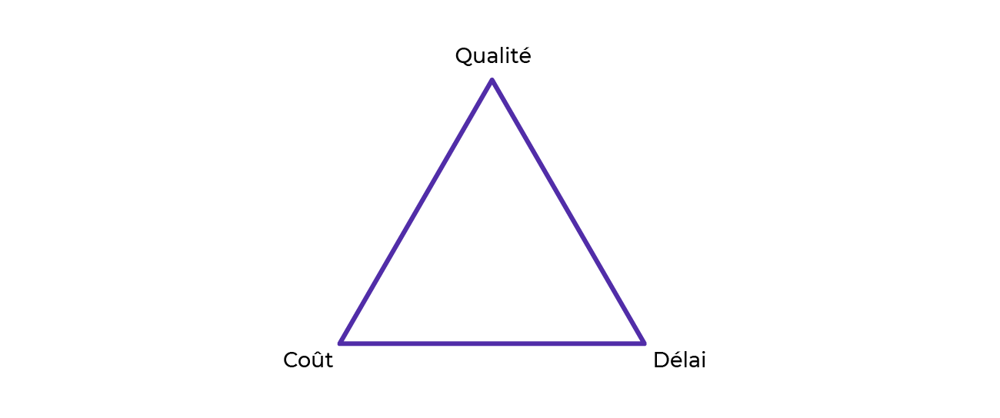

## Contexte du projet

### Projets Digitaux

Ce cours se concentrera sur les projets digitaux, tels que la création de sites web, d'applications mobiles, ou de logiciels. Bien que ces projets aient des caractéristiques et des exigences spécifiques, ils suivent les mêmes principes fondamentaux de gestion de projet.

### Démarrage d'un Projet

Tout projet commence par l'identification d'un besoin, qui est ensuite formulé en objectif(s). La clarté et la précision de cette étape sont cruciales pour la réussite du projet.

#### Projets Internes vs. Externes

- **Projets Internes** : Initiés et gérés au sein de l'organisation. Leurs défis incluent souvent l'alignement, les ressources, et la méthodologie de gestion.
- **Projets Externes** : Lancés par une organisation mais réalisés par un prestataire externe. L'expression des besoins et la sélection du prestataire sont des étapes clés.

### Communication avec le Commanditaire

L'établissement d'un dialogue ouvert avec le commanditaire est essentiel pour cerner les besoins explicites et implicites, les traduire en livrables potentiels, et comprendre la grille de lecture du commanditaire pour maximiser les chances de réussite de l'appel d'offres.

Lors de vos échanges exploratoires, au-delà d'un relationnel irréprochable, vous allez porter une attention particulière à 4 choses :

* les **besoins explicites** du client
* les **besoins implicites** du client
* les **livrables potentiels**
* et sa **grille de lecture** supposée

### Analyse et Recueil des Besoins

La première tâche du chef de projet est de comprendre et de compléter les besoins exprimés, les traduire en objectifs clairs et définir les livrables.

Lors de vos échanges exploratoires, au-delà d'un relationnel irréprochable, vous allez porter une attention particulière à 4 choses :

* les **besoins explicites** du client
* les **besoins implicites** du client
* les **livrables potentiels**
* et sa **grille de lecture** supposée

#### Besoins explicites

Par "besoins explicites", comprenez les besoins exprimés clairement, sans ambiguïté et sur lesquels il y a un consensus. Pour s'assurer de la compréhension de ces besoins, essayez de reformuler et observer la réaction de votre interlocuteur.

| Besoin | Livrable(s) potentiel(s) |
|--------|--------------------------|
| Développer une présence en ligne | Site vitrine, plan web marketing |
| Moderniser une image de marque | Plateforme de marque avec charte graphique et logo |
| Permettre aux clients de réserver en ligne | Système de réservation |

#### Besoins implicites

Ce sont les besoins qui ne seront pas explicité par le commanditaire, mais dont vous savez l'importance cruciale pour que le projet soit utile. Il faudra le prendre en compte dès le début du projet. Ce sont souvent des besoins que vous relevez après avoir discuter de manoère très ouverte avec le commanditaire.

| Besoins explicites | Besoins implicites | Livrable(s) potentiel(s) |
|--------------------|--------------------|--------------------------|
| Développer une présence en ligne | Rendre le site accessible dans 4 langues | Site web (multilingue) |
| Moderniser une image de marque | Conserver le nom et le logo de l'établissement | Adaptation de la charte graphique |
| Système de réservation | Permettre au staff de l'hôtel de gérer ses prix et ses réservations en back-office | Système de réservation + gestion |

#### Livrables du Projet

**Livrables** : Résultats de la réalisation du projet, pouvant être tangibles ou intangibles, mais clairement définis et livrés au client.

### Décrypter la Grille de Lecture du Commanditaire

Lors de la communication avec un client potentiel, une étape clé est de comprendre sa "grille de lecture". Cette grille représente les critères sur lesquels le commanditaire va baser sa sélection du prestataire pour le projet. Comprendre ces critères est crucial pour anticiper les attentes du client et adapter votre proposition commerciale de manière stratégique.

#### Comprendre la Grille de Lecture

La grille de lecture peut varier grandement d'un commanditaire à l'autre, mettant l'accent sur différents aspects tels que :

- **Compréhension de la Problématique** : Degré auquel le prestataire saisit les enjeux du projet.
- **Budget** : Alignement des estimations du prestataire avec les contraintes financières du commanditaire.
- **Esthétique des Livrables** : Importance de la qualité visuelle et du design des outputs du projet.
- **Relationnel avec le Prestataire** : Valeur accordée à la qualité de la communication et de la relation de travail.

#### Exercice de Décryptage

Pour décoder efficacement la grille de lecture de votre client potentiel, engagez-vous dans les actions suivantes :

1. **Listez les Critères** : Identifiez les aspects que le commanditaire semble privilégier lors de vos échanges.
2. **Établissez une Hiérarchie** : Classez ces critères par ordre d'importance, selon votre compréhension des priorités du commanditaire.

#### Exemple de Grille de Lecture Supposée

Voici un exemple simplifié pour illustrer comment vous pourriez organiser la grille de lecture de votre commanditaire, basée sur des critères fréquemment rencontrés :

| Critère de Sélection | Importance |
|----------------------|------------|
| Compréhension de la Problématique | Très important |
| Budget | Important |
| Esthétique des Livrables | Moyennement important |
| Relationnel avec le Prestataire | Peu important |

#### Application Pratique

En disposant d'une grille de lecture supposée, vous pouvez mieux orienter votre proposition commerciale pour qu'elle réponde aux attentes prioritaires de votre commanditaire. Ce processus n'est pas seulement un exercice de devinette mais nécessite une écoute active, une analyse fine des retours du commanditaire, et une certaine intuition professionnelle.

N'oubliez pas, cependant, que cette grille n'est qu'une hypothèse de départ et qu'elle peut évoluer au fur et à mesure que vous approfondissez votre relation avec le client. Restez donc attentif et flexible, prêt à ajuster votre compréhension des besoins et attentes du commanditaire.

### En Résumé

La gestion de projet est un processus dynamique qui nécessite une compréhension claire des objectifs, une planification rigoureuse, et une communication efficace avec toutes les parties prenantes. Que ce soit pour un projet interne ou externe, la réussite dépend de l'analyse approfondie des besoins, de la traduction de ces besoins en actions concrètes, et de la capacité à naviguer dans les spécificités et les attentes du commanditaire.

Le chemin vers la réussite d'un projet digital est pavé de défis uniques, mais aussi d'opportunités d'apprentissage et de croissance. Prêts à plonger dans l'aventure de la gestion de projet digital ? Suivez-nous dans les prochains chapitres pour une exploration approfondie de chaque étape du processus de gestion de projet.

# Cadrez le projet avec votre équipe

A ce moment là, nous avons recueilli le besoin client, et décrypter une grille de lecture.:spy:

Cependant vous ne pouvez pas encore faire de proposition commerciale. Vous pourrez tout de même présenter suffisament d'éléments à votre équipe, les solliciter pour apporter les informations manquantes à la réalisation d'une proposition commerciale.

Autrement dit, au début d'un projet, lors de la phase d'initialisation, vous allez commencer par recueillir et analyser les informations du client, pour ensuite les mettre en commun avec celles de votre équipe afin de planifier, budgétiser et synthétiser le tout dans un document contractuel. :bookmark_tabs:

> Appelons "**étude de faisabilité**" toutes les étapes qui précédent la proposition commerciale. Pour vous, chef de projet, cette phase est une sorte de chasse aux informations. Celle-ci s'arrête lorsque vous connaîtrez suffisamment les tenants et aboutissants du projet pour informer vos prises de décisions et évaluer l'intérêt de celui-ci.

## Le rôle du chef de projet

Rôle transverse parfois difficile à appréhender, car il est plus facile pour nous de comprendre le rôle d'un développeur ou d'un ingénieur car leurs compétences sont facilement identifiables.

Le chef de projet est l'interface entre toutes les parties prennantes d'un projet (corps de métiers et commanditaire). Tel un chef d'orchestre, ne sachant jouer d'un instrument mais capable d'organiser la marche commune de tout les musiciens pour arriver au résultat escompté. On peut aussi utiliser l'analogie du metter en scène :smile: .

> Un chef de projet coordonne l'ensemble des activités du projet pour garantir l'atteinte de l'objectif et le respect des exigences de qualité, de coûts et de délais.

Le chef de projet a deux maître-mots : `Organisation` et `Communication`. La majeur partie de son temps est passé dans la création et ma mise à jour de document, et communiquer par message électroniques et réunion.

## L'expertise

Le chef de projet n'est pas expert en tout. En revanche, il doit être capable de s'appuyer sur lexpertise de son équipe, et leur permettre d'avoir les meilleurs conditions de travail.

Certes, avoir des compétences fondamentales dans les corps de métiers que vous coordonnez est un avantage mais ne vous y méprenez pas, sauf exception ou double-casquette, c'est sur vos compétences de gestion de projet que vous serez attendu.

Ne vous substituez donc pas à vos experts. Cela peut s'avérer frustrant pour eux et parfois même contre-productif pour le projet.

### Réunion de cadrage

La réunion de cadrage est cruciale dans le processus de gestion de projet. Elle sert à aligner tous les membres de l'équipe sur les besoins du client et à poser les bases pour l'élaboration d'une solution adaptée. Voici comment structurer et mener cette réunion pour en maximiser l'efficacité.

#### Ordre du Jour Type

1. **Restitution des Besoins** : Commencez par une présentation claire des besoins exprimés par le client. Utilisez des documents, des notes ou des visuels pour appuyer votre exposé et assurez-vous que l'expression des besoins soit la plus précise et complète possible.
2. **Élaboration d'une Solution** : Engagez l'équipe dans une discussion pour élaborer une solution globale qui répond aux besoins identifiés. Encouragez la collaboration et la créativité, permettant à chaque expert de contribuer à partir de son domaine de compétence.
3. **Estimation de la Charge de Travail** : Avec l'aide des experts techniques, commencez à estimer la charge de travail requise pour réaliser le projet. Cela implique d'évaluer le temps, les ressources et les compétences nécessaires.

#### Conseils pour une Réunion Efficace

- **Préparation** : Assurez-vous que tous les participants ont accès aux informations relatives aux besoins du client avant la réunion pour qu'ils puissent venir préparés.
- **Participation Active** : Encouragez la participation de tous les membres de l'équipe. Chaque perspective est importante pour une compréhension complète du projet.
- **Consignation des Décisions** : Documentez les solutions proposées, les estimations de charge de travail et tout autre décision importante prise pendant la réunion. Ces notes seront cruciales pour la planification ultérieure du projet.
- **Gestion du Temps** : Gardez la réunion ciblée et efficace. Un bon cadrage en amont permet d'éviter que la réunion ne s'éternise sans aboutir à des résultats concrets.

#### À l'Issue de la Réunion

Vous devriez avoir une vision claire des prochaines étapes nécessaires pour la planification du projet. Si des informations complémentaires sont nécessaires, identifiez qui sera responsable de les collecter et fixez des délais. La réussite de cette réunion est un premier pas décisif vers la réussite du projet.

Une réunion de cadrage bien conduite met en place les fondations solides nécessaires à la gestion efficace d'un projet, en s'assurant que toutes les parties prenantes sont alignées et prêtes à collaborer vers la réalisation des objectifs communs.

### La réunionite aiguë

Une image vaut mille mots :

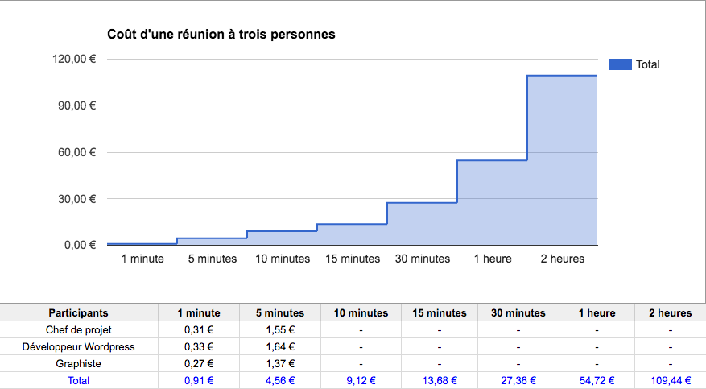

Utilsez un minuteur pour gérer vos réunions, et respectez votre ordre du jour. N'hésitez pas à recadrer les dérives qui arrivent (car nous sommes tous humain). Ne jouez pas l'autorité, mais inspirez la productivité et l'enthousiasme !

## La méthodologie de gestion de projet

Lors de la réunion de cadrage, un des points cruciaux à aborder est le choix de la méthodologie de gestion de projet qui sera employée. Tout comme un développeur sélectionne la technologie adaptée à un projet, le choix de la méthodologie est déterminant pour la conduite du projet.

Les méthodologies de gestion de projet se divisent en deux grandes catégories : classiques et agiles. Chaque famille a ses spécificités et est adaptée à des contextes de projet différents.

### Les Méthodologies Classiques

> Les méthodologies de gestion de projet classiques, aussi appelées méthodes prédictives, séquentielles comme la méthode en cascade ou le cycle en V, impliquent un déroulement en étapes, en séquences, en phases. Ces phases correspondent à des ensembles de tâches prédéfinies dans un planning de réalisation précis.

Un projet en cascade par exemple se déroule généralement en **5 phases** :

1. La phase d'**initialisation** : dans laquelle nous sommes actuellement, qui précède la proposition commerciale et qui prend fin au moment de l'acceptation du devis. :mag: :dart:
2. La phase de **lancement** : dans laquelle vous re-préciserez et formaliserez tous les éléments du projet dans un "cahier des charges". Vous apprendrez ce qu'est un cahier des charges et comment en rédiger un dans la deuxième partie de ce cours. Cette phase se termine à la signature de ce fameux document. :pencil: :writing_hand:️
3. La phase de **conception** : dans laquelle vous accompagnerez votre équipe dans la création des éléments graphiques et textuels à partir desquelles le site sera développé, produit. :scissors:️ :frame_photo:
4. La phase de **production** : dans laquelle votre équipe créera le produit final à partir des éléments réalisés en phase de conception. Cette phase s'achève à la livraison du produit. :tools: :gift:
5. La phase d'**exploitation** : dans laquelle le produit est livré conformément aux attentes et qu'il suffit de maintenir ou de faire évoluer. :rocket: :recycle:️

> 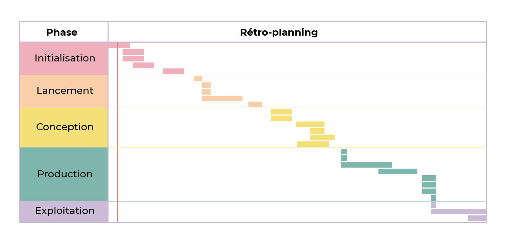
> Pour plus de contrôle, fixez des dates de début et de fin à chacune des phases voire à chaque tâche si nécessaire. Ces deadlines intermédiaires s'appellent des "**jalons**". :timer:

<table>
<tr>
<th>Avantages</th>
<th>Inconvénients</th>
</tr>
<tr>
<td>

* Précision des échéances
* Clarté et visualisation de l'état d'avancement
* Budgetisation facile
</td>
<td>

* Détection tardive des risques
* Peu de marge d'erreur
</td>
</tr>
</table>

### Les Méthodologies Agiles

> Les méthodologies agiles se veulent être itératives, incrémentales et adaptives. Autrement dit, plutôt que de rigidement compléter des étapes les unes après les autres, le développement du produit se fait par couches amenant chacune de nouvelles évolutions. Ainsi, le produit peut être testé et amélioré en continu (petit à petit) tout au long du projet plutôt qu'à la fin.

<table>
<tr>
<th>Avantages</th>
<th>Inconvénients</th>
</tr>
<tr>
<td>

* Meilleur réactivité aux imprévues
* Détection rapide des risques
</td>
<td>

* Planification peu précise
* Budgetisation difficile
</td>
</tr>
</table>

### Classique ou Agile ?

L'agile est très tendance dans le digital, et le classique est très traditionnel dans les domaines plus ancien comme l'ingénierie ou le BTP.

L'agilité, plus récente et moderne, peut paraître plus attrayant, **mais attention** : ne choisissez pas votre méthodologie en fonction de sa réputation ou sa modernité. Il vous faudra choisir en fonction de la **prédictibilité** de votre projet.

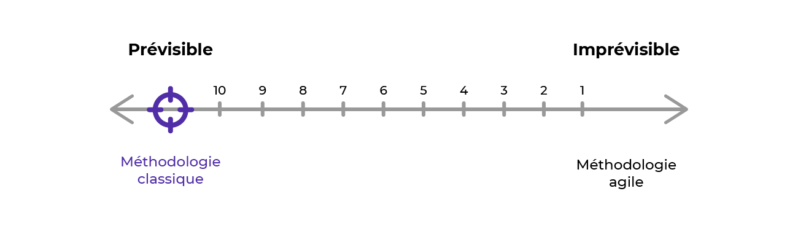

Si vous évaluer votre projet entre les deux, trouvez un compromis entre vos préférences, celles de votre équipe et la solution qui rassurera le plus votre client.

Plus le projet a d'inconnues, plus vous aurez besoin d'agilité pour y faire face. En revanche, si celui-ci est très prévisible, vous aurez intérêt à privilégier la précision pour vous organiser et communiquer plus efficacement son avancée.

> Si le risque technologique est insignifiant, le projet lui, n'est pas sans risque non plus. À ce risque technologique peut alors se substituer un risque humain. Ainsi, un projet jugé "trop facile" ou "peu stimulant" peut parfois être pris à la légère et susciter un manque de rigueur. 
>
> Au même titre qu'une équipe peut être **sous-qualifiée** pour un projet elle peut aussi être **sur-qualifiée**. 

Pour la création d'un site web permettant de faire des réservations pour un hôtel, c'est un projet avec peu d'inconnu et assez bien maîtrisé. C'est donc une méthodologie classique qui conviendra.

Puis au sein même d'une famille de méthodologie classique, vous pourrez aussi hésiter entre les différentes méthodes : **Cascade**, **Cycle en V** et autres.. Nous verrons ici la méthode en cascade, et son outil de plannification : **le diagramme de Gantt**

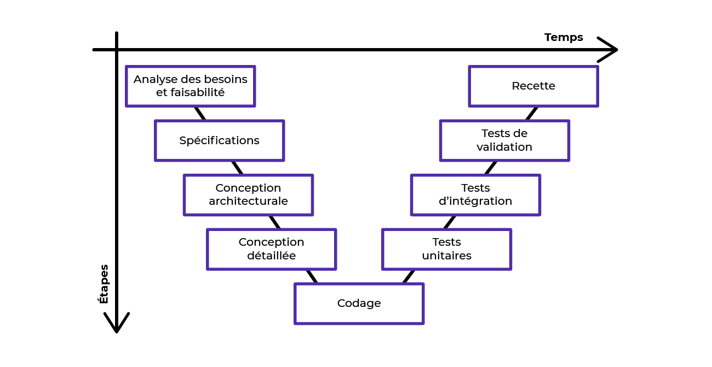

# Planifiez la réalisation de votre projet avec un diagramme de Gantt

Une fois que vous avez une estimation claire de la charge de travail de votre équipe, il est temps de passer à la phase de planification du projet. Cette étape cruciale détermine non seulement le calendrier de votre projet mais établit également les attentes en termes de délais que vous vous engagez à respecter tout au long du projet.

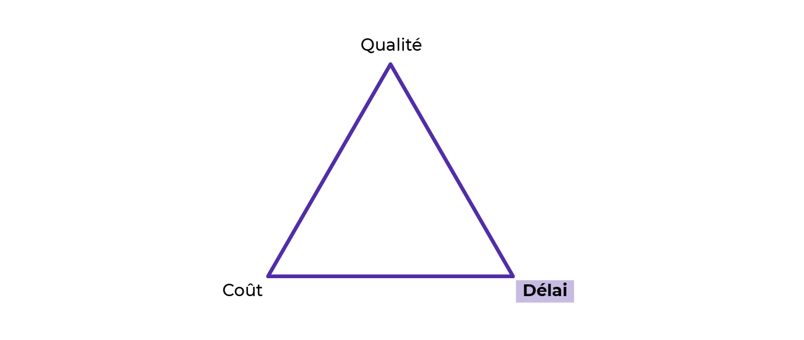

## Créer un diagramme de Gantt

Le diagramme de Gantt est une méthode classique de planification et de gestion qui permet de représenter visuellement l'état d'avancement d'un projet.

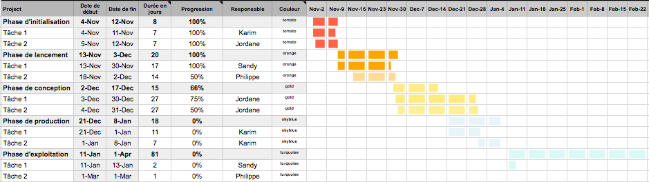

### Choisir son outil

Choisir l'outil de gestion de projet le plus adapté est crucial pour le bon déroulement de votre projet. Comme pour tout choix technique, il est judicieux d'établir une grille de lecture basée sur vos besoins spécifiques et les critères qui sont les plus importants pour vous et votre équipe.

Lors de la sélection de votre outil de gestion de projet, considérez les critères suivants, classés par ordre d'importance :

1. **Fonctionnalités** : Évaluez la gamme de fonctionnalités offertes par l'outil et leur pertinence par rapport aux besoins de votre projet.
2. **Présentation** : La lisibilité et l'ergonomie de l'outil sont essentielles pour une utilisation quotidienne efficace.
3. **Prix** : Déterminez si l'outil offre un bon rapport qualité-prix, en considérant les options gratuites comme payantes selon votre budget.

Pour un projet nécessitant une collaboration étroite et une esthétique soignée, un outil comme Monday pourrait être privilégié malgré son coût, en raison de ses fonctionnalités collaboratives avancées et de son interface utilisateur attrayante.

Cependant, il est possible de gérer un projet efficacement avec des outils plus basiques et accessibles, comme un tableur excel, particulièrement pour la création d'un diagramme de Gantt.

**Avantages d'un Tableur :**

- **Coût** : Souvent disponible gratuitement ou inclus dans des suites bureautiques déjà acquises.
- **Flexibilité** : Permet une personnalisation complète selon vos besoins spécifiques.
- **Accessibilité** : La plupart des membres de l'équipe sont familiers avec l'utilisation des tableurs.

Bien que moins intuitif que des logiciels spécialisés, un tableur peut être une solution efficace et économique pour créer un diagramme de Gantt, surtout avec l'utilisation d'un template préparé.

- **Template Préparé** : Utilisez un modèle déjà conçu pour économiser du temps et vous concentrer sur l'essentiel de la planification du projet.
- **Apprentissage Transférable** : Maîtriser la création d'un diagramme de Gantt dans un tableur vous préparera à utiliser des outils spécialisés plus complexes avec facilité.

> Voici quelques logiciels libres et gratuits vous permettant d’utiliser le diagramme de Gantt :
>
> * [**ProjectLibre**](https://sourceforge.net/projects/projectlibre/) : solution de gestion de projet open source, gratuite et très plébiscitée
> * [**TaskJuggler**](https://taskjuggler.org/) : original dans son approche avec un mode édition pour la description des tâches et leurs dépendances ainsi qu'un mode rapport pour pouvoir visualiser l’ensemble
> * [**GanttProject**](https://www.ganttproject.biz/) : logiciel libre et gratuit à installer sur son ordinateur
> * [**Redmine**](https://www.redmine.org/) : une autre application web libre de gestion de projets comportant également d’autres fonctionnalités
>
> La gestion de projet par diagramme de Gantt peut aussi se faire avec des outils en ligne comme [**Monday**](https://monday.com/), [**Asana**](https://asana.com/) ou encore [**Wrike**](https://wrike.com/). Attention, néanmoins, car leur version gratuite reste moins performante que leur contrepartie payante.
>
> _Notez qu'une bonne partie de ces logiciels sont intégralement en anglais._
>
> Vous préférez utiliser Notion ? Retrouvez ici un tutoriel vous expliquant comment "[**Créer un diagramme de Gantt sur Notion**](https://vimeo.com/814518894/1e012d447d)".

### Détail des Tâches et Estimation de la Charge de Travail

Lors de la gestion d'un projet, en particulier dans une approche en cascade, il est essentiel de détailler précisément les tâches de chaque phase du projet et d'estimer leur charge de travail. Cette planification vous permet de prévoir les ressources nécessaires et de structurer le projet de manière cohérente.

#### Comment Identifier les Tâches ?

1. **Projection dans les Phases du Projet** : Envisagez le déroulé des cinq phases principales du projet (Initialisation, Lancement, Conception, Production, Exploitation) et listez les tâches spécifiques à chacune.
2. **Consultation des Experts** : Pour les domaines hors de votre expertise (ex. développement, graphisme), consultez directement les membres de l'équipe concernés pour obtenir une liste précise des tâches et une estimation de leur charge de travail.

#### Estimation de la Charge de Travail

- **Unité de Mesure** : La charge de travail est souvent exprimée en jours-homme ou demi-journée-homme, représentant le temps nécessaire pour qu'une personne accomplisse une tâche donnée (Chez INEVO : ETP = Equivalent Temps Plein).
- **Regroupement des Petites Tâches** : Pour les tâches de courte durée, envisagez de les regrouper pour simplifier la planification et maintenir la clarté du projet.

#### Équilibrage de la Granularité des Tâches

- **Trouver l'Équilibre** : Une liste de tâches trop détaillée peut nuire à la lisibilité du projet, tandis qu'une liste pas assez détaillée peut rendre le diagramme moins utile. Votre objectif est de trouver le juste milieu.
- **Granularité Adaptée** : Visez une granularité qui permette de comprendre facilement le flux de travail sans se perdre dans les détails mineurs.

#### Exemple de Détail des Tâches par Phase

##### Phase d'Initialisation

- Définition du périmètre du projet
- Établissement des objectifs et des livrables

##### Phase de Lancement

- Rédaction du cahier des charges
- Validation des spécifications techniques

##### Phase de Conception

- Création des maquettes et prototypes
- Validation du design avec le client

##### Phase de Production

- Développement des fonctionnalités
- Tests et corrections des bugs

##### Phase d'Exploitation

- Mise en production
- Suivi et maintenance

### Assigner les tâches aux membres de l'équipe

Après avoir établi la liste des tâches et leur durée estimée, l'étape suivante consiste à les attribuer aux membres de votre équipe. Cette phase est cruciale pour assurer que chaque tâche est confiée à la personne la mieux adaptée pour la mener à bien.

#### Choix des Membres d'Équipe pour les Tâches

- **Évaluation des Compétences et de la Disponibilité** : Identifiez la personne la plus apte à réaliser chaque tâche, en prenant en compte non seulement les compétences et l'expérience mais aussi la disponibilité.
- **Équilibrage entre Expérience et Coût** : Parfois, les membres les moins expérimentés peuvent être les plus appropriés pour certaines tâches, permettant d'économiser des ressources sans sacrifier la qualité du travail.

#### Gestion des Disponibilités

- **Vérification de la Disponibilité** : Avant d'attribuer une tâche, assurez-vous que la personne assignée est disponible pour y travailler dans le délai requis.
- **Gestion des Priorités et des Projets Multiples** : Soyez conscient que vous et votre équipe pouvez être impliqués dans plusieurs projets à la fois. Planifiez en conséquence pour éviter les surcharges.

#### Planification des Tâches

- **Assignation des Dates de Début et de Fin** : Définissez des dates de début et de fin pour chaque tâche et chaque phase du projet, en tenant compte des estimations de charge de travail.
- **Gestion des Dépendances et des Chevauchements** : Identifiez les tâches qui dépendent d'autres tâches et planifiez-les de manière séquentielle pour éviter les goulots d'étranglement. Faites attention aux chevauchements potentiels et ajustez le planning si nécessaire.

> 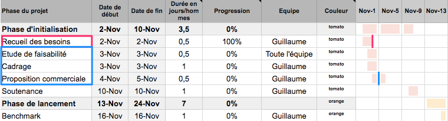
>
> Dépendances de plusieurs tâches : Pour qu'un projet soit mené de manière optimale, vous devez chercher à minimiser les temps morts, c'est-à-dire les périodes d'inactivité durant lesquelles un ou plusieurs membres de l'équipe sont bloqués à cause d'une dépendance.

> 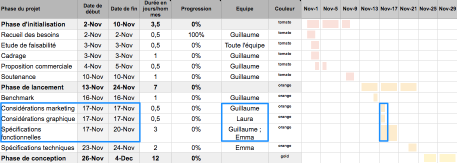
>
> Chevauchement de trois tâches

#### Conseils pour une Planification Efficace

- **Communication Claire** : Informez chaque membre de l'équipe des tâches qui lui sont attribuées, des attentes en termes de délais et de qualité, et de l'importance de sa contribution au projet global.
- **Flexibilité** : Soyez prêt à ajuster les attributions de tâches et le planning en fonction de l'évolution du projet et des imprévus.
- **Suivi et Soutien** : Assurez un suivi régulier de l'avancement des tâches et soyez disponible pour fournir soutien et conseils aux membres de l'équipe en cas de besoin.

En suivant ces étapes et conseils, vous serez en mesure de créer un planning de projet réaliste et efficace, où chaque tâche est attribuée de manière judicieuse, maximisant ainsi les chances de réussite du projet.

### Suivi et Mise à Jour de la Progression du Projet

Lorsque votre planification est en place et que chaque tâche a été attribuée, avec des estimations de temps, des responsables désignés, ainsi que des dates de début et de fin prévues, votre diagramme de Gantt devient un outil central non seulement pour la planification mais aussi pour le suivi quotidien du projet. Voici comment gérer efficacement la mise à jour de votre progression.

#### Suivi de la Progression des Tâches

##### Trois Scénarios Possibles

1. **Retard** : Si vous constatez que les tâches prennent plus de temps que prévu, il est crucial d'identifier rapidement les causes du retard et de prendre les mesures nécessaires pour y remédier.
2. **Dans les Temps** : Si le projet avance conformément au planning, continuez le suivi régulier pour maintenir cette dynamique.
3. **Avance** : Une progression plus rapide que prévue peut libérer des ressources plus tôt et augmenter la marge bénéficiaire du projet.

##### Gestion de la Progression

- **Mise à Jour Régulière** : Actualisez le niveau de progression de chaque tâche dans votre diagramme de Gantt à intervalles réguliers pour refléter l'avancement réel du projet.
- **Communication** : Informez les parties prenantes des mises à jour significatives, qu'il s'agisse de retards, de conformité aux délais, ou d'avances notables.

#### Ajustements et Actions Correctives

##### En Cas de Retard

- **Analyse des Causes** : Identifiez les raisons du retard pour apporter les corrections nécessaires.
- **Réaffectation des Ressources** : Considérez la possibilité de réallouer des ressources pour accélérer les tâches en retard.
- **Révision du Planning** : Si nécessaire, ajustez les dates de fin prévues pour refléter la nouvelle réalité du projet.

##### En Cas d'Avance

- **Réévaluation des Ressources** : Déterminez si les ressources libérées peuvent être utilisées pour d'autres tâches ou projets.
- **Anticipation des Prochaines Phases** : Profitez de l'avance pour préparer les étapes suivantes du projet.

#### Bilan et Amélioration Continue

- **Évaluation des Estimations** : Prenez le temps d'évaluer la précision de vos estimations initiales pour améliorer vos techniques de planification pour les futurs projets.
- **Capitalisation sur l'Expérience** : Documentez les leçons apprises et les meilleures pratiques émergentes pour enrichir le savoir-faire de l'équipe.

La gestion efficace de la progression du projet nécessite vigilance, adaptabilité et communication transparente. En suivant ces principes et en ajustant activement votre planification, vous maximiserez les chances de succès de votre projet, tout en renforçant vos compétences en gestion de projet.

## Avantages et limites du diagramme de Gantt

<table>
<tr>
<th>Avantages</th>
<th>Inconvénients</th>
</tr>
<tr>
<td>

* simple à créer 
* précis
* facile à comprendre pour toutes les parties prenantes
</td>
<td>

* nécessite des mises à jour régulières
* éventuels problèmes d'affichage sur des projets complexes
</td>
</tr>
</table>

# Budgétisez votre projet

Le budget calculé en interne n'est pas le budget proposé au client. Ici nous allons calculer le budget interne, c'est à dire le coût de revient du projet. c'est à partir de celui ci qu'on prépare la proposition commerciale avec le budget client.

## Différencier les postes de dépenses

Cela peut correspondre par exemple à :

* des ressources **matérielles**
* des ressources **informatique** (licences, logiciels)
* des ressources **humaines** (salaires)

Selon la nature de votre projet, certains postes de dépenses seront plus importants que d'autres.

Dans un projet digital comme celui de notre scénario (réalisation d'un site web pour un hôtel), avant même de calculer précisément le budget, vous pouvez vous attendre à ce que les ressources humaines représentent le premier poste de dépense.

> 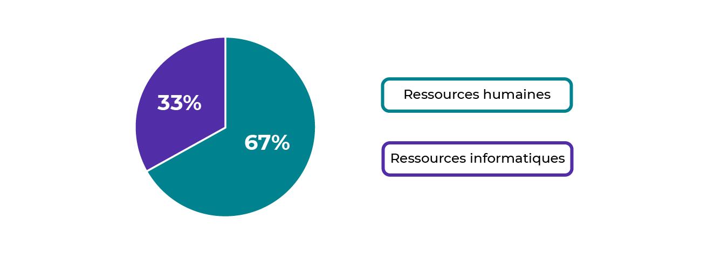

## Calculer le coût total du projet

Calculer le budget prévisionnel d'un projet revient à calculer le coût de chacune des 5 phases qui le composent.

`**Coût total du projet** = coût phase d'initialisation + coût phase de lancement + coût phase de conception + coût phase de production + coût phase d'exploitation` Avec : `**Coût total d'une phase** = coût tâche 1 + coût tâche 2 + coût tâche n...` et ; `**Coût estimé d'une tâche** = durée estimée de la tâche * coût des personnes impliquées`

Pour trouver le coût journalier de la personne impliquée, référez-vous à votre grille de salaires :

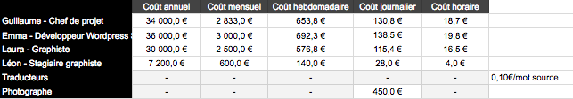

> Pour l'entreprise, un salarié coûte plus cher que son salaire brut. Pour prévoir et gérer au mieux les coûts de votre projet, demandez à votre comptable ou à votre directeur de vous transmettre le coût global/total d'un salarié. **Coût d'un salarié = salaire brut + charges patronales**

Maintenant, il faut faire cela pour toute les tâches (vive excel) :  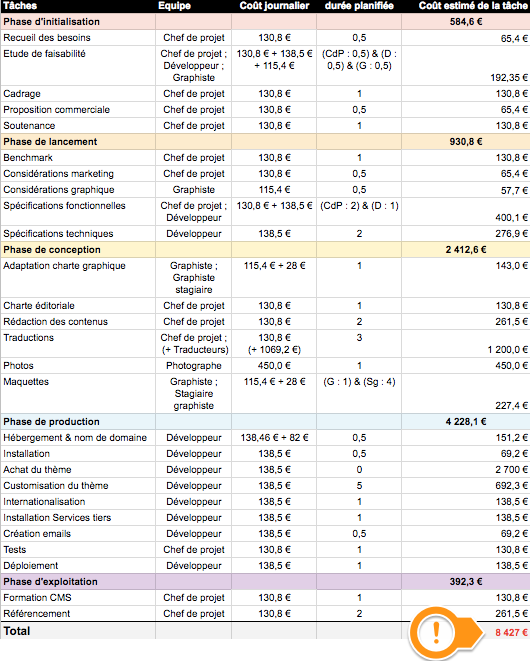

> Lorsque vous avez des ressources matérielles ou informatiques, n'oubliez pas de les inclure dans votre calcul. Ici l'achat de la licence complète du thème WordPress gonfle le budget prévisionnel de 2700 € ; ce n'est pas négligeable.

On peut aussi calculer le coût de chaque phase : 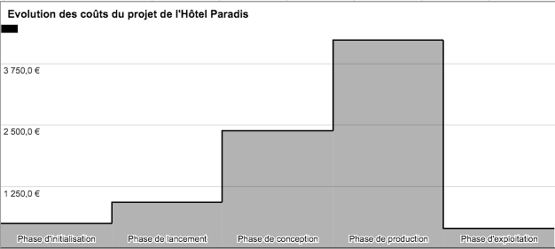

> Notez qu'au stade de la budgétisation prévisionnelle, ces coûts ne sont que des estimations et pas des coûts réels. Au fur et à mesure du projet, vous allez donc suivre l'évolution de ces coûts et mettre à jour votre budget en fonction. À la fin du projet, vous allez donc faire un comparatif entre le prévisionnel et le réel.

> Vous préférez utiliser Notion ? Retrouvez ici un tutoriel vous expliquant comment "[**Créer un budget sur Notion**](https://vimeo.com/814518864/88f40c44c4)".

# Rédigez votre proposition commerciale

Après avoir soigneusement **recueilli et analysé les besoins du client**, tenu une **réunion de cadrage** productive avec votre équipe et **planifié le projet** en détail, vous avez acquis une compréhension solide des exigences du projet et établi un **budget prévisionnel**. Vous êtes désormais prêt à **finaliser l'étude de faisabilité** et à passer à la rédaction de la **proposition commerciale**.

> Si votre proposition ne parvient pas à convaincre le client de vous sélectionner, alors tout le travail fait jusqu'à présent aura été une perte de temps et donc d'argent... 

## Structure du document

Au minimum,

* Une page de garde
* Une note de synthèse
* Un devis

mais aussi,

* des conditions de ventes en annexe
* une version plus rédigée de l'étude de faisabilité

Selon l'ampleur du projet concerné, son niveau de complexité, le risque et le profil du client, votre proposition commerciale sera plus ou moins détaillée. Ainsi vous n'adresserez pas la même proposition au gérant d'une organisation de 10 personnes pour un projet de 10000 € et au comité d'une organisation de 5000 personnes pour un projet de 500000 €. Cela peut sembler être du bon sens mais ça ne coûte rien de le re-préciser. :smile:

Ci-dessous un exemple de structure de proposition commerciale plus détaillé :

1. **Introduction** : Commencez par une introduction engageante, présentant brièvement votre entreprise et l'objectif de la proposition.
2. **Compréhension des Besoins** : Démontrez une compréhension profonde des besoins et des attentes du client, reflétant votre écoute et votre analyse préalables.
3. **Solution Proposée** : Décrivez la solution que vous proposez, en insistant sur sa pertinence par rapport aux besoins identifiés et comment elle répond aux objectifs du client.
4. **Planification et Méthodologie** : Fournissez un aperçu de votre plan de projet, y compris les phases clés, la méthodologie de gestion de projet choisie et la manière dont vous assurez le respect des délais et du budget.
5. **Budget et Estimations** : Présentez un résumé clair et détaillé du budget, en justifiant les coûts prévus et en mettant en avant le rapport qualité-prix de votre offre.
6. **Équipe Projet** : Mettez en avant les compétences et l'expertise de votre équipe, soulignant pourquoi elle est la mieux placée pour réaliser ce projet.
7. **Témoignages et Références** : Incluez des témoignages de clients précédents et des études de cas pertinentes pour renforcer votre crédibilité.
8. **Conclusion et Appel à l'Action** : Terminez par une conclusion forte, réaffirmant votre enthousiasme pour le projet et invitant le client à prendre les prochaines étapes avec vous.

## Rédiger une note de synthèse

Trois sous parties devraient suffire :

1. Une **description du projet et des besoins** qui lui sont propres.
2. La **solution préconisée** pour répondre à ces besoins.
3. L'**objectif daté et si possible chiffré** du projet.

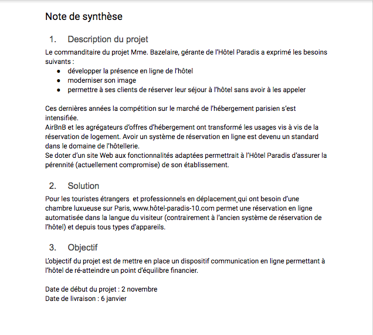{width="523" height="470"}

> Lorsque vous rédigez votre note de synthèse, gardez à l'esprit la grille de lecture supposée du client.

## Formaliser un devis

A la suite de la note de synthèse sera inclu un devis. Un devis est une proposition de prix que vous vous engagez à ne pas modifier tant que le client ne s'est pas engagé contractuellement.

### Poser la trame

Ayez en tête qu'un devis est un document juridique. Il faut donc faire attention à respecter les normes et la réglementation en vigueur dans le pays concerné. En France, certaines mentions obligatoires doivent figurer sur le devis : 

* La durée de validité de l'offre
* L'indication manuscrite, datée et signée du client : « Lu et accepté »
* la mention « Lu et accepté », daté et signé par l'entrepreneur

Pour approfondir le cadre juridique du devis, [voici la documentation officielle du gouvernement](https://entreprendre.service-public.fr/vosdroits/F31144). Si impératif juridique spécifique à votre activité, il y a, vous pouvez ajouter **des annexes**, spécifiant les termes et conditions de ces services annexe (service après vente, formation etc...)📎

### Calculer votre marge commerciale

une fois la trame posée, il ne reste plus qu'a la remplir avec les informations de base, la liste des livrables du projet et les prix que vous proposez.

Deux risques principaux : 

* **Une proposition trop chère** augmente le risque de ne pas remporter l'appel d'offre
* **Une proposition pas assez cher** et vous risquez de tirer peu de profit, voir d'être en perte.

Pour diminuer le risque, il faudra habillement calculer le prix de vente, et donc votre marge commerciale.

`Marge commerciale = prix de vente - coût de revient` 

`Prix de vente = marge commerciale + coût de revient`

Dans l'exemple du site web de l'hôtel Paradis, le coût de revient est de 8427 €. Pour déterminer à combien nous allons vendre au client, il faut déterminer une marge de manoeuvre. Il faut donc déterminer une marge **minimale** et **maximale.**

Pour la marge maximale, on utilise directement le budget client, par exemple ici 15 000 €.

`Marge maximum = 15 000 - 8427 = `**`6 573 €`**

Pour la marge minimale, on peut se référer à la politique de votre entreprise. Imaginons que l'agence réalisant le site web encourage ses chefs de projet à ne pas se lancer dans des projets avec moins de 50% de taux de marge : 

`Taux de marge = (marge commerciale / coût de revient) * 100`

`Marge commerciale minimum = 8 427 * 0,5`

`Marge commerciale minimum = 4 213 €`

`Prix de vente minimum = 4 213 + 8 427 = `**`12 640 €`**

`Taux de marge maximum = (6 573 / 8 427) * 100 = 78%`

À vous donc de manoeuvrer entre :

* Une **marge minimum de 50%** pour un prix de vente de **12 640 €** qui se voudrait être très compétitif.
* Une **marge maximum de 78%** pour un prix de vente de **15 000 €** qui se voudrait être très gourmande.

Pour décider, vous pourrez prendre en compte divers critères tels que la santé de votre entreprise, celle de votre client, et votre connaissance du marché.

Toujours dans notre exemple, disons que l'agence qui réalise le site web se porte mieux que l'hôtel Paradis, il conviendra donc de faire une proposition qui tende vers le bas. Combien proposeriez-vous ?

Personnellement, je proposerais un prix de vente brut à **13 500 €** HT. Cela représenterait un taux de marge de **59%** qui semble équilibré. 

Vous allez donc pouvoir impacter plus ou moins proportionnellement cette marge sur tous les livrables listés dans votre devis.

> Dernier point : plus la santé financière de votre client est mauvaise, plus vous aurez intérêt à demander un acompte important pour compenser le risque de défaut de paiement. Dans notre scénario, nous demanderons à être payé 40% du montant (5 400 €) avant de mobiliser des ressources sur le projet de l'hôtel Paradis.

# Défendez votre proposition commerciale

Si votre offre a suffisamment intéressé le commanditaire de l'appel d'offre, il se peut que vous soyez invité à défendre votre offre lors d'une soutenance. 

## Préparer sa soutenance

La préparation est essentielle. Ne venez pas en équipe, un seul interlocuteur est plus facile pour votre commanditaire. Ceci est le rôle du chef de projet. De plus, mobiliser toute une équipe a un coût non négligeable.

En tant que chef de projet, vous devez être capable de répondre à tout type de question : technique ou autre. Il faut donc comprendre les choix fait par vos experts et être capable de les défendre. Il faut être capable de les vulgariser si nécessaire, sans prendre de haut votre interlocuteur, ni le perdre.

Un support visuel peut être intéressant pour appuyer votre soutenance. Anticipez la logistique si vous vous déplacer. Vous n'aurez pas forcément un rétroprojecteur à disposition.

## Défendez votre proposition

### Jouer une soutenance

La soutenance d'un projet est une véritable performance, où l'art de communiquer est tout aussi crucial que le contenu présenté. Voici comment marquer positivement votre audience et inspirer confiance. 

#### Stratégies de Conviction

- **Adaptez votre approche** : Choisissez entre émouvoir ou convaincre par la logique en fonction du profil de l'interlocuteur.
- **Projetez une relation future** : Montrez-vous comme le partenaire idéal, capable de dépasser les attentes.

#### Maîtrise et Communication

- **Préparez-vous** : Une bonne connaissance de votre présentation vous permettra de vous concentrer sur le comment plutôt que sur le quoi.
- **Exercez-vous** : La répétition transforme le stress en assurance et affûte votre message.
- **Utilisez un langage corporel positif** : Une posture ouverte et un contact visuel soutenu renforcent votre message.
- **Soyez interactif** : Impliquez votre auditoire pour maintenir son attention et ajustez votre discours en fonction de ses réactions.

### Adopter la bonne posture

Projeter une image de confiance et de compétence est crucial lors d'une soutenance de projet. Voici quelques stratégies pour vous assurer de laisser une impression positive et gérer efficacement les interactions avec votre client.

#### Signaux de Confiance

- **Posture** : Tenez-vous droit pour projeter confiance et préparation.
- **Détente** : Gardez vos épaules détendues pour montrer que vous êtes à l'aise.
- **Sourire** : Un sourire sincère invite à la communication positive.
- **Rythme** : Parlez à un rythme contrôlé, évitant la précipitation ou l'hésitation.
- **Écoute active** : Montrez que vous êtes attentif aux besoins et questions de votre interlocuteur.
- **Code vestimentaire** : Adaptez votre tenue aux normes de votre client pour créer une première impression positive.

#### Gestion de la Parole

- Maîtrisez la conversation sans la monopoliser pour éviter de frustrer votre interlocuteur.
- Soyez prêt à faire des pauses pour permettre des questions ou des commentaires.

#### Gestion des Questions

* Scénario Idéal : Le client attend la fin de votre présentation pour poser ses questions, vous permettant de développer votre argumentation sans interruption.

* Scénario d'Interruptions : Préparez-vous à être interrompu et à répondre aux questions au fil de l'eau. Anticipez les objections courantes pour y répondre avec assurance.

#### Conclusion et Suivi

- À la fin de la session de questions/réponses, remerciez votre client pour son attention et son temps.
- Convenez ensemble d'une date pour un prochain contact, préparant le terrain pour une réponse positive.

En suivant ces conseils, vous serez mieux préparé à gérer votre soutenance de projet, à instaurer une atmosphère de confiance et d'engagement, et à naviguer avec aisance dans les différentes phases de l'interaction avec votre client.

