# Formalisez votre projet dans un cahier des charges

Deuxième bonne nouvelle, dans notre scénario, la proposition commerciale que nous avons adressée puis défendue à l'hôtel Paradis a été acceptée. Le client a signé le devis. Nous avons remporté l'appel d'offres ! :confetti_ball:

Nous pouvons donc passer à la suite : la phase de lancement du projet.

> 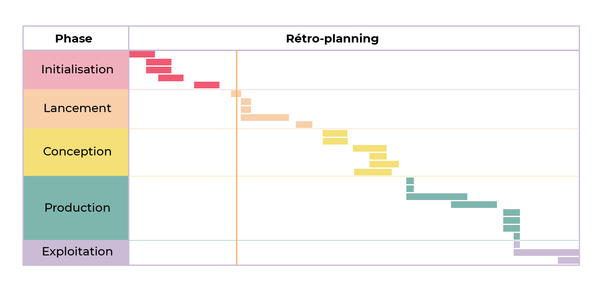
>
> _Diagramme de Gantt : après l'initialisation, le lancement du projet_

La phase de lancement est cruciale pour démarrer un projet sur de bonnes bases. Elle consiste à préparer et formaliser tous les éléments clés qui guideront les phases ultérieures du projet, notamment la conception, la production, et l'exploitation.

Durant cette étape, vous élaborerez le cahier des charges, un document fondamental qui servira de référence tout au long du projet. Ce document détaille les exigences, les objectifs, les spécifications, et les contraintes du projet, assurant ainsi une compréhension commune entre toutes les parties prenantes.

## Cahier des Charges : Un Pilier du Projet

### Qu'est-ce qu'un Cahier des Charges ?

Le cahier des charges (CDC) est essentiel dans la préparation d'un projet. Ce document contractuel détaille tout ce qui est nécessaire pour mener à bien le projet, formalisant ainsi la demande du client. Ne pas suivre les spécifications du CDC peut exposer à des risques juridiques, soulignant son importance pour le succès du projet.

### L'Importance du CDC

Un CDC précis est crucial pour prévenir les erreurs et les malentendus, permettant ainsi d'identifier et de corriger les problèmes potentiels dès le début. Certains chefs de projet minimisent l'importance de ce document, ce qui peut conduire à des erreurs évitables et à une mauvaise gestion des responsabilités.

### Qui Rédige le Cahier des Charges ?

La responsabilité de la rédaction du CDC varie selon le contexte du projet :

- **Projets d'envergure** : Le client ou son équipe peut prendre en charge la rédaction pour aligner le projet sur leurs besoins spécifiques.
- **Projets complexes** : La maîtrise d'ouvrage peut être déléguée à une agence, et la réalisation à une autre.
- **Projets plus modestes** : Comme dans notre exemple de l'hôtel Paradis, où le client n'a pas l'expertise requise, la rédaction du CDC revient au chef de projet.

Dans tous les cas, le CDC est souvent le fruit d'un travail collaboratif impliquant diverses compétences, assurant que toutes les facettes du projet soient couvertes.

## Rédaction d'un Cahier des Charges

La rédaction du cahier des charges (CDC) est une étape décisive dans la préparation de tout projet. Bien que la perspective d'un document détaillé puisse sembler intimidante, une approche étape par étape facilitera grandement cette tâche.

### Structure du CDC

Il n'existe pas de format unique pour un CDC ; sa structure peut varier selon le type de projet et l'organisation concernée. Toutefois, pour vous guider dans cette entreprise, voici un modèle de base qui peut être adapté à vos besoins :

- **Introduction du Projet**
- **Contexte et Objectifs**
- **Description Détaillée des Besoins**
- **Spécifications Techniques**
- **Contraintes et Exigences**
- **Calendrier et Livrables**
- **Budget Estimatif**

### Gestion de la Longueur du CDC

La longueur idéale d'un CDC dépend de la complexité du projet. Voici quelques considérations pour trouver le juste milieu :

<table>
<tr>
<td>

**Plus votre CDC est long et détaillé :**
</td>
<td>

**Plus votre CDC est court et synthétique :**
</td>
</tr>
<tr>
<td>

* Moins il y a aura de risques pour que la commande ne soit pas respectée
* Plus il vous prendra du temps (et donc de l'argent) à rédiger
* Plus il sera difficile à consulter et à mettre à jour 
</td>
<td>

* Plus il y aura de risques liés à son interprétation
* Moins il vous prendra de temps (et donc d'argent) à rédiger
* Plus il sera facile à consulter et à mettre à jour
</td>
</tr>
</table>

### Équilibre et Clarté

Votre objectif est de rédiger un CDC suffisamment détaillé pour prévenir les erreurs tout en restant assez clair et concis pour être facilement consultable. Un document bien structuré, clair, et accessible favorisera son utilisation effective par toutes les parties prenantes.

### Conclusion

La rédaction d'un CDC est une tâche exigeante mais essentielle pour le succès de votre projet. Prenez le temps nécessaire pour bien le structurer, le détailler et l'adapter aux spécificités de votre projet, tout en veillant à maintenir un équilibre entre précision et concision. Cela posera les fondations solides nécessaires à une réalisation de projet harmonieuse et conforme aux attentes de toutes les parties impliquées.

Lors de la phase d'initialisation de votre projet, vous avez déjà dû récolter les informations de la première section du cahier des charges (le cadre du projet). Vous n'avez donc qu'à les remettre en forme. :grinning:

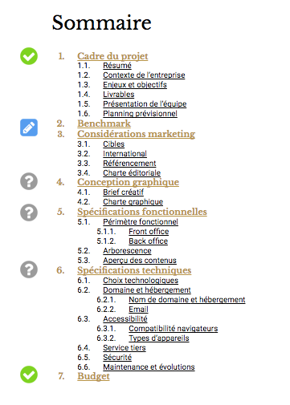

# Intégrez une réflexion marketing à votre projet

La rédaction d'un cahier des charges (CDC) est souvent perçue comme une tâche ardue, principalement associée à la paperasserie. Cependant, cette étape clé de la gestion de projet digital offre bien plus que la simple production de documents.

Le CDC n'est pas juste un exercice de rédaction. Il s'agit d'un processus stratégique où chaque section reflète une analyse approfondie d'un aspect particulier du projet. Plutôt que de le voir comme une corvée, envisagez-le comme une opportunité de structurer et de clarifier votre vision du projet.

- **Diversité des Supports** : La rédaction du CDC n'est pas limitée à des paragraphes de texte. Utilisez des tableaux, des visuels, des schémas, et même des maquettes pour illustrer et communiquer efficacement vos idées.
- **Stimulation Intellectuelle** : Chaque section du CDC invite à une réflexion spécifique sur le projet, rendant l'exercice varié et engageant.
- **Communication Visuelle** : Les éléments visuels peuvent souvent communiquer des concepts complexes de manière plus efficace et plus accessible que le texte seul.
- **Clarté et Organisation** : Le processus de création du CDC aide à organiser vos idées et à clarifier les objectifs du projet pour toutes les parties prenantes.
- **Base pour la Discussion** : Un CDC bien élaboré sert de fondement pour les discussions et les négociations avec le client, en assurant que toutes les attentes soient alignées.

La création d'un cahier des charges est loin d'être une simple rédaction administrative. C'est une composante cruciale de la planification de projet qui demande réflexion, créativité, et précision. Approchez cette tâche avec l'esprit ouvert et la volonté d'exploiter pleinement son potentiel pour structurer efficacement votre projet. En embrassant la diversité des formats et la richesse des contenus, la rédaction du CDC devient une partie intégrante et stimulante du processus de gestion de projet.

## Section "Benchmark" du Cahier des Charges

### Qu'est-ce qu'un Benchmark ?

Le benchmark est une analyse comparative qui consiste à étudier les pratiques de la concurrence afin de positionner votre projet dans un contexte de marché. C'est un état des lieux des projets similaires ou concurrents qui sert de référence pour identifier des opportunités d'amélioration ou d'innovation.

### Application dans un Projet Digital

Pour un projet digital, comme la refonte du site de l'hôtel Paradis, le benchmark implique l'analyse de sites web leaders dans le secteur de l'hôtellerie. Cela permet d'identifier les bonnes pratiques à adopter et les erreurs à éviter.

### Points Clés à Analyser

Lors de votre benchmark, concentrez-vous sur les aspects suivants :

- **Ergonomie** : Évaluez la facilité de navigation et l'adaptabilité aux différents appareils (mobiles, tablettes, etc.).
- **Charte Éditoriale** : Observez le ton utilisé, les langues disponibles, et la clarté des informations.
- **Charte Graphique** : Notez l'utilisation des typographies, des couleurs, et l'harmonie visuelle.
- **Fonctionnalités** : Identifiez les fonctionnalités clés comme les systèmes de réservation en ligne, les newsletters, etc.
- **Technologie Utilisée** : Détectez les plateformes et outils technologiques utilisés (ex. WordPress).

### Retranscription du Benchmark

Pour intégrer vos analyses dans le cahier des charges :

- **Listez les Sites Étudiés** : Présentez brièvement chaque site analysé.
- **Capture d'Écran** : Ajoutez une capture d'écran pour chaque site pour illustrer vos points.
- **Tableau de Points Forts et Faibles** : Créez un tableau résumant les forces et les faiblesses identifiées pour chaque site.

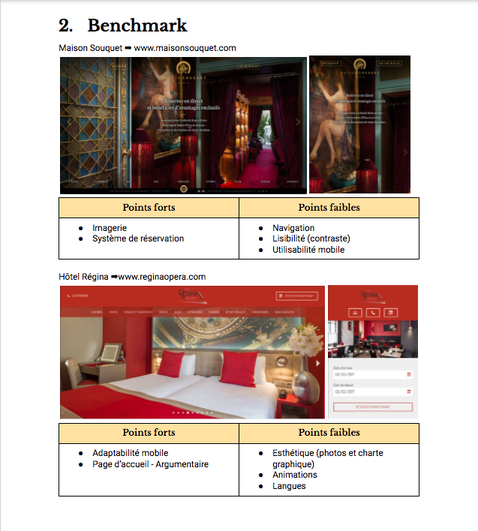

### Utilité du Benchmark

Un benchmark bien documenté vous offre une vision claire des tendances du secteur et des standards de qualité. Utilisez ces informations pour définir des points de vigilance et des objectifs d'amélioration pour votre projet, en vous inspirant des succès et en apprenant des erreurs des autres.

En somme, le benchmark est un outil précieux pour orienter la conception de votre projet digital, en vous assurant de rester compétitif et pertinent dans votre secteur d'activité.

## Section "Considérations Marketing" du Cahier des Charges

La section "Considérations Marketing" de votre cahier des charges est cruciale pour aligner votre projet digital avec les réalités du marché et les attentes des clients cibles.

### Définir le Marketing

Le marketing englobe toutes les actions stratégiques et tactiques entreprises pour aligner l'offre de votre projet avec la demande du marché. Il s'agit de comprendre profondément les besoins et les désirs de votre clientèle cible pour créer des solutions qui répondent précisément à ces attentes.

### Comprendre la Demande

- **Identification du Client-Cible (Persona)** : Définissez clairement qui sont vos clients idéaux, leurs comportements, leurs préférences et leurs besoins spécifiques.
- **Analyse du Marché** : Examinez le marché pour comprendre les tendances actuelles, les besoins non satisfaits et les opportunités potentielles.

> 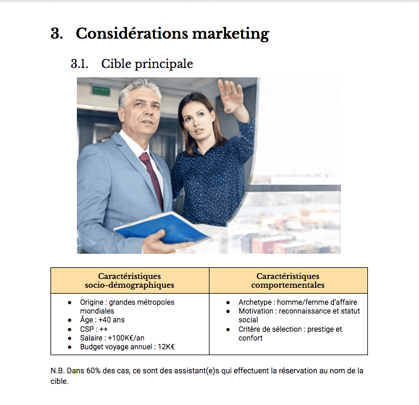
>
> Exemple d'une cible présentée sous forme de persona

> 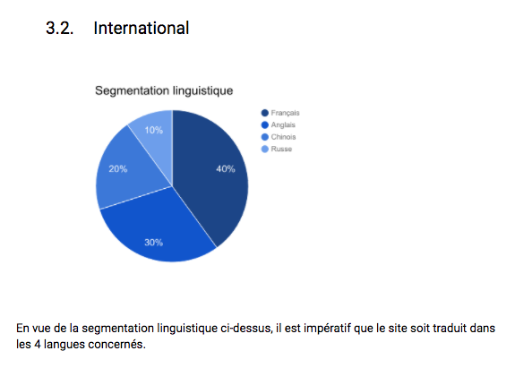
>
> Exemple de segmentation linguistique

### Élaboration de la Section

Pour structurer efficacement cette section, pensez à inclure :

- **Vue d'Ensemble du Marché** : Présentez un aperçu du marché visé, incluant la taille, le potentiel de croissance, et les principaux acteurs.
- **Analyse des Clients-Cibles** : Détaillez les caractéristiques et les attentes de votre clientèle cible, en vous appuyant sur des recherches de marché.
- **Stratégies de Positionnement** : Décrivez comment votre projet se positionnera sur le marché pour répondre efficacement à la demande identifiée.
- **Approches Marketing Prévues** : Esquissez les grandes lignes des stratégies marketing que vous envisagez d'adopter pour promouvoir votre projet auprès de votre public cible.

La section "Considérations Marketing" de votre cahier des charges peut être enrichie de sous-parties supplémentaires pour couvrir des aspects spécifiques du marketing digital. La portée de cette section dépendra des exigences du projet et des services convenus avec le commanditaire.

Selon les besoins du projet, vous pouvez envisager d'ajouter des sous-sections telles que :

- **Référencement (SEO et SEM)** : Stratégies pour améliorer la visibilité du site sur les moteurs de recherche.
- **Branding** : Développement de l'identité de marque, incluant le logo, la palette de couleurs, et la ligne éditoriale.
- **Charte Éditoriale** : Directives pour le ton, le style et la langue du contenu du site web.
- **Plan de Lancement** : Stratégies pour l'introduction du site web ou du produit digital sur le marché.
- **Autres Éléments Spécifiques** : Toute autre considération marketing pertinente pour le projet.

Il est essentiel de clarifier avec le commanditaire l'étendue des services attendus. Si le contrat ne couvre que la création d'un site web, par exemple, l'élaboration d'un plan marketing détaillé pourrait ne pas être incluse.

- **Définir le Périmètre** : Assurez-vous que les attentes du commanditaire en matière de marketing sont bien comprises et clairement définies dans le contrat.
- **Allocation des Ressources** : Évaluez les ressources disponibles et évitez d'investir du temps dans des activités qui ne sont pas couvertes par l'accord.

### Pour résumer :

* Assurez-vous de bien **comprendre le marché cible** de votre projet avant de vous y lancer.
* Faire un **benchmark n'est pas une perte de temps**, au contraire.
* Créer un cahier des charges peut être un exercice de **communication visuel, fun et stimulant**.
* Chaque section du cahier des charges doit être développée dans la **juste mesure de la commande**.

# Rédigez les spécifications fonctionnelles de votre projet

Dans un projet digital, les spécifications fonctionnelles sont une section du cahier des charges ou un document à part entière qui spécifie, décrit, précise les fonctionnalités du site, de l'application ou du logiciel en question. 

## Définition du Périmètre Fonctionnel via l'Impact Mapping

L'impact mapping est une méthode efficace pour délimiter le périmètre fonctionnel de votre projet digital. Elle aide à clarifier les fonctionnalités nécessaires en fonction des besoins des utilisateurs, en partant de l'objectif global jusqu'aux actions spécifiques que les utilisateurs souhaitent réaliser sur le site.

### Étapes de l'Impact Mapping

1. **Objectif du Site** : Déterminez l'objectif principal de votre site. Exemple : Augmenter le chiffre d'affaires de l'hôtel.
2. **Profils Utilisateurs** : Identifiez les différents types d'utilisateurs qui interagiront avec votre site.
3. **Actions Utilisateurs** : Listez les actions que ces utilisateurs souhaitent accomplir sur le site.
4. **Fonctionnalités Nécessaires** : Déduisez les fonctionnalités qui supporteront ces actions, complétant ainsi le périmètre fonctionnel du site.

### Mise en Pratique : Exemple de l'Hôtel Paradis

L'impact mapping de l'Hôtel Paradis pourrait ressembler à ceci :

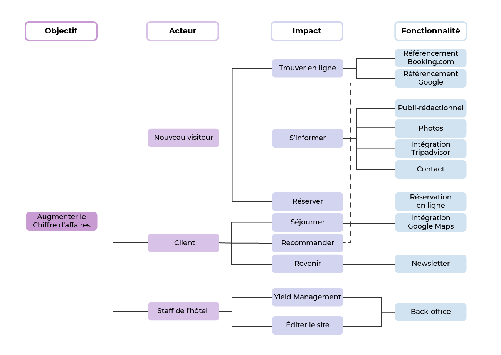

Chaque colonne de l'impact mapping correspond à l'une des questions-clés, facilitant ainsi la visualisation du parcours utilisateur et des fonctionnalités à développer.

### Outils pour l'Impact Mapping

- **Papier et Crayon** : Idéal pour esquisser rapidement vos premières idées.
- **Éditeurs Graphiques** : Utilisez des outils comme Google Drawings pour créer des schémas clairs et professionnels.
- **Logiciels de Carte Mentale** : Parfaits pour structurer visuellement les relations entre objectifs, utilisateurs, actions, et fonctionnalités.
- **Logiciels Spécialisés** : Des outils dédiés à l'impact mapping peuvent également être utilisés pour des projets plus complexes.

L'impact mapping est un outil stratégique pour définir le périmètre fonctionnel de votre site web de manière exhaustive et alignée avec les objectifs du projet. En suivant cette méthodologie, vous établissez une fondation solide pour le développement de votre projet digital, assurant que chaque fonctionnalité contribue à atteindre l'objectif global.

## Schématiser l'arborescence d'un site

L'arborescence d'un site est une représentation schématique des différentes pages qui composeront le site, liées entre elles et hiérarchisées par niveaux de profondeur.

Ce schéma servira alors de modèle à vos équipes techniques qui pourront ainsi se représenter la structure du site.

Voici un exemple vide :

> 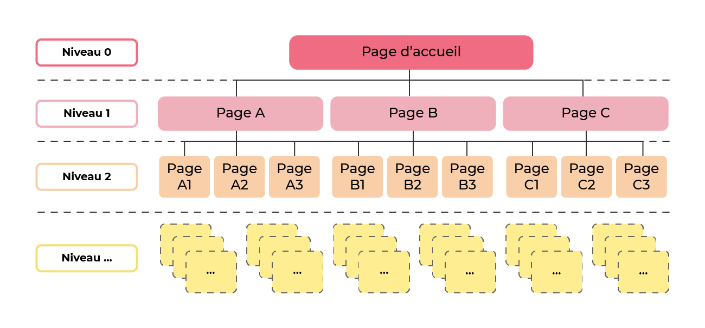
>
> _Schéma d'arborescence de site Web_

Une arborescence efficace nécessite un périmètre fonctionnel bien défini. Sans cela, déterminer les pages requises devient difficile, risquant de désorienter les utilisateurs. Une préparation adéquate est donc cruciale pour une navigation intuitive et une structure de site alignée aux objectifs du projet.

Puisque nous avons fait ce travail préparatoire avec l'impact mapping de l'hôtel Paradis, traduisons-le en arborescence de la manière suivante :

> 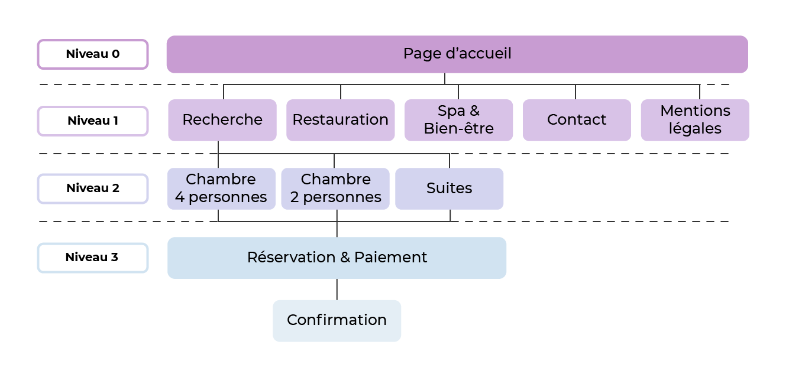
>
> _Schéma d'arborescence du futur site de l'hôtel Paradis_

La création d'une arborescence de site nécessite d'abord une visualisation claire. Bien que l'approche initiale "papier et crayon" soit excellente pour jeter les bases, plusieurs outils numériques peuvent ensuite aider à peaufiner et présenter votre arborescence de manière professionnelle.

### Options d'Outils Numériques

- **Éditeurs Graphiques** : Parfaits pour créer des schémas clairs, ils permettent une flexibilité dans la conception de l'arborescence.
- **Logiciels de Carte Mentale** : Idéals pour structurer des idées de manière hiérarchique, facilitant la visualisation de l'arborescence verticale du site.
- **Logiciels Spécialisés** : Balsamiq et autres outils similaires offrent des fonctionnalités dédiées à la conception UX/UI, y compris la schématisation d'arborescences.

### Conseils pour la Schématisation

- **Commencez Simple** : Utilisez le papier pour esquisser rapidement votre idée avant de passer à un outil numérique.
- **Choisissez l'Outil Adapté** : Sélectionnez l'outil avec lequel vous vous sentez le plus confortable et qui répond le mieux à vos besoins de visualisation.
- **Pensez à l'Utilisateur** : Gardez à l'esprit la facilité de navigation pour l'utilisateur final lors de la conception de votre arborescence.

## En résumé

* Définissez le périmètre fonctionnel de votre site de la manière la plus exhaustive possible avant de passer à la suite.
* Ne commencez pas à concevoir votre site avant d'avoir défini son arborescence.
* Pour réaliser ces schémas, utilisez l'outil avec lequel vous êtes le plus à l'aise.
* N'hésitez pas à consulter vos coéquipiers pour enrichir vos spécifications fonctionnelles.

# Réalisez le zoning et le wireframe d'un site web

Après avoir précisé le périmètre fonctionnel et l'arborescence de votre site, il est temps de passer à l'étape des ébauches. Ces premières esquisses, appelées zonings et wireframes, vont servir de références dans la phase de conception.

La "fidélité" d'une maquette désigne son degré de précision par rapport à la version finale du produit. On distingue :

- **Basse Fidélité** : Les esquisses initiales, où rien n'est encore décidé et l'esthétique n'est pas prise en compte.
- **Moyenne Fidélité** : Un niveau intermédiaire où les grandes décisions sont prises mais les détails esthétiques restent à finaliser.
- **Haute Fidélité** : Des maquettes très détaillées, correspondant précisément à l'aspect final du site.

Évoluer de la basse à la haute fidélité permet d'éviter l'optimisation prématurée, une erreur fréquente qui consiste à perfectionner un aspect du projet trop tôt, avant que les grandes lignes ne soient définitivement arrêtées.

Les techniques de conception initiale :

- **Le Zoning** : Il s'agit de définir les grandes zones du site (en-tête, pied de page, contenu principal, etc.) sans se soucier des détails. Cette étape permet d'organiser l'espace et de planifier la disposition générale.
- **Le Wireframing** : Cette technique consiste à créer un schéma plus détaillé du site, incluant les éléments clés comme les boutons, les images, et les blocs de texte. Les wireframes de moyenne fidélité commencent à donner une idée plus précise du produit final sans pour autant se concentrer sur le design graphique.

Pour démarrer, une approche manuelle (papier et crayon) peut être suffisante pour le zoning et les wireframes basse fidélité. Pour des wireframes de moyenne fidélité, des outils numériques tels que Balsamiq ou Sketch peuvent être utiles pour ajouter un niveau de détail intermédiaire.

## Organiser les pages de votre site avec le zoning

Le zoning est une technique de maquettage basse fidélité qui permet d'organiser le contenu d'une page web en la divisant en différentes zones.

Une première façon artisanale :

> 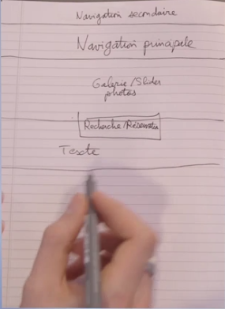
>
> _Zoning d'une page d'accueil fait à la main_

Une autre manière de faire à l'aide d'un éditeur graphique :

> 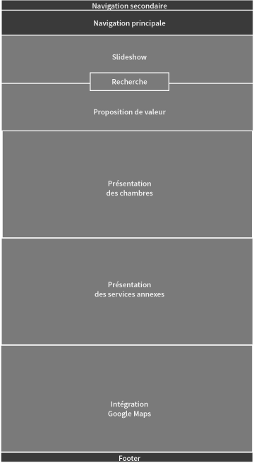
>
> _Zoning réalisé avec un éditeur graphique_

Pour cette dernière, je vous invite donc à suivre les étapes suivantes :

1. Pour chaque page listée dans votre arborescence, préparez 3 canevas, un pour chaque support (mobile 320 x 480 px, tablette 768 x 1024 px , ordinateur 1280 x 800 px).
2. Sélectionnez deux nuances de gris.
3. En commençant par les versions mobiles, avec votre première nuance de gris, créez des rectangles pour représenter les éléments persistants d'une page à l'autre, par exemple une navigation principale, un fil d'ariane ou un footer.
4. Avec votre deuxième nuance de gris, créez des rectangles pour représenter les éléments contextuels de chaque page en vous appuyant sur votre impact mapping.
5. Répétez la 4e étape pour toutes les pages listées dans l'arborescence.

Si votre commanditaire est très disponible et impliqué dans le processus de création, vous pouvez d'ores et déjà lui envoyer ce zoning pour validation.

## Placer tous les éléments qui composent le site avec le wireframing

Un wireframing (ou maquette fil de fer en français) est une technique utilisée pour créer des versions basse/moyenne fidélité d'un livrable.

C'est une couche de détail en plus sur vos maquettes. Si vous avez un zoning bien fait, il suffit de remplacer les zones par les éléments qui les composent.

> 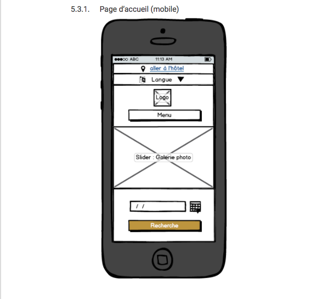
>
> _Maquette fil de fer d'une page d'accueil mobile_

> 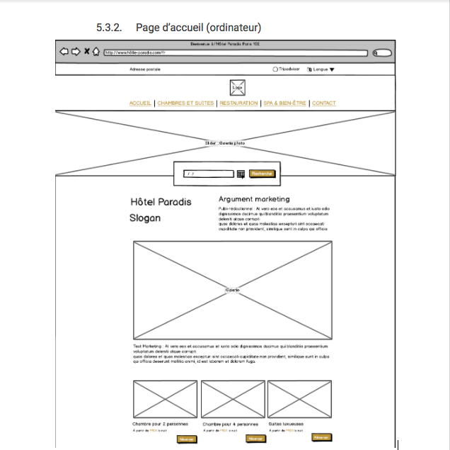
>
> _Maquette fil de fer d'une page d'accueil (ordinateur)_

À ce stade, vous n'avez toujours pas à vous soucier de l'exactitude de :

* la taille des éléments,
* ni de leur couleur,
* ni de leur alignement.

Votre graphiste s'en chargera pendant la phase de conception. En revanche, assurez-vous de **bien placer tous les éléments nécessaires pour que le site remplisse ses fonctions**.

Cela vous économisera des aller-retours potentiellement chronophages et donc coûteux s' ils sont faits sur des maquettes haute fidélité. :relieved:

## Passage de basse résolution à haute résolution

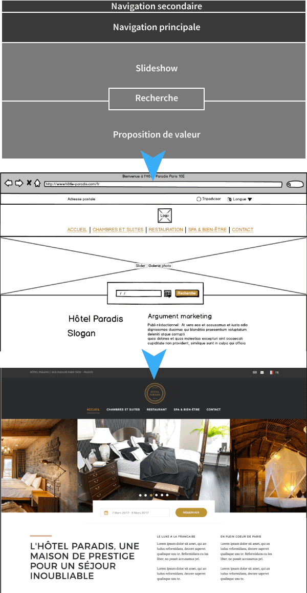

### Pour finir :

* Se discipliner pour d'abord passer des maquettes basse fidélité aux maquettes moyenne fidélité, puis des maquettes moyenne fidélité aux maquettes haute fidélité, n'est pas une perte de temps, au contraire.
* Réalisez vos maquettes en étroite collaboration avec votre graphiste ou déléguez-lui.
* Faites régulièrement valider vos maquettes par le commanditaire. 

# Rédigez les spécifications techniques de votre projet

Avant de renvoyer votre cahier des charges au client pour une dernière validation, vous allez devoir **traduire ou faire traduire vos spécifications fonctionnelles** (vues au dernier chapitre) **en spécifications techniques**. 

## **Rédiger des spécifications techniques**

Les **spécifications techniques** d'un cahier des charges sont une documentation des méthodes, procédés, et technologies sélectionnées pour faire face aux contraintes de réalisation du projet.

Vous pouvez vous faire une idée de ce qu'est la section "spécifications techniques" simplement en regardant le sommaire et les sous-sections qui la composent.

Selon que vous avez un profil technique ou non, vous allez plus ou moins déléguer la rédaction de cette section aux techniciens. Dans le scénario de la création du site web de l'hôtel Paradis, c'est la développeuse qui est la mieux placée pour rédiger cette section. Le chef de projet devra tout de même s'assurer que la forme est bonne.

Dans d'autres cas, peut-être le vôtre, le chef de projet est lui-même un technicien polyvalent qui se chargera alors de rédiger cette documentation même si ce n'est pas lui qui exécute.

## **Rationaliser et expliquer ses choix**

Vos choix techniques ou ceux de votre équipe ne feront pas toujours l'unanimité.  

Lorsque vous êtes confronté à des choix technologiques délicats pendant la rédaction des spécifications techniques de votre projet, la technique de la scorecard, ou fiche d'évaluation, est un outil précieux pour éclairer et justifier vos décisions.

La scorecard est un outil d'aide à la décision qui permet de comparer objectivement différentes options selon des critères prédéfinis. Chaque option est évaluée et notée sur chacun de ces critères, facilitant ainsi la mise en évidence de la solution la plus adaptée aux besoins du projet.

1. Créez un tableau.

   |  |  |  |  |  |
   |--|--|--|--|--|
   |  |  |  |  |  |
   |  |  |  |  |  |
   |  |  |  |  |  |

2. Listez vos options dans la première colonne.

   |  |  |  |  |  |
   |--|--|--|--|--|
   | Wordpress |  |  |  |  |
   | Joomla |  |  |  |  |
   | Drupal |  |  |  |  |

3. Listez vos critères d'évaluation dans la première ligne.

   |  | Administration | Modules | Expertise interne |  |
   |--|----------------|---------|-------------------|--|
   | Wordpress |  |  |  |  |
   | Joomla |  |  |  |  |
   | Drupal |  |  |  |  |

4. Donnez un poids (pondération) à chacun de ces critères en fonction de leur importance.

   <table>
   <tr>
   <th>

   </th>
   <th>

   Administration

   (0.4)
   </th>
   <th>

   Modules

   (0.3)
   </th>
   <th>

   Expertise interne

   (0.3)
   </th>
   <th>

   Total

   /1
   </th>
   </tr>
   <tr>
   <td>Wordpress</td>
   <td>

   </td>
   <td>

   </td>
   <td>

   </td>
   <td>

   </td>
   </tr>
   <tr>
   <td>Joomla</td>
   <td>

   </td>
   <td>

   </td>
   <td>

   </td>
   <td>

   </td>
   </tr>
   <tr>
   <td>Drupal</td>
   <td>

   </td>
   <td>

   </td>
   <td>

   </td>
   <td>

   </td>
   </tr>
   </table>

5. Cellule par cellule, pour chaque critère, donnez un score sur 1 à vos options

   <table>
   <tr>
   <th>

   </th>
   <th>

   Administration

   (0.4)
   </th>
   <th>

   Modules

   (0.3)
   </th>
   <th>

   Expertise interne

   (0.3)
   </th>
   <th>

   Total

   /1
   </th>
   </tr>
   <tr>
   <td>Wordpress</td>
   <td>0.9</td>
   <td>0.8</td>
   <td>1</td>
   <td>

   </td>
   </tr>
   <tr>
   <td>Joomla</td>
   <td>0.5</td>
   <td>0.5</td>
   <td>0.2</td>
   <td>

   </td>
   </tr>
   <tr>
   <td>Drupal</td>
   <td>0.5</td>
   <td>0.4</td>
   <td>0.3</td>
   <td>

   </td>
   </tr>
   </table>

6. Calculez le score total (pondéré) de chaque option en multipliant chaque score par le poids de sa colonne.

    **`Score total Wordpress`** `= (0,9 * 0,4) + (0,8 * 0,3) + (1 * 0,3) = `**`0,9` **

   <table>
   <tr>
   <th>

   </th>
   <th>

   Administration

   (0.4)
   </th>
   <th>

   Modules

   (0.3)
   </th>
   <th>

   Expertise interne

   (0.3)
   </th>
   <th>

   Total

   /1
   </th>
   </tr>
   <tr>
   <td>Wordpress</td>
   <td>0.9</td>
   <td>0.8</td>
   <td>1</td>
   <td>0.9</td>
   </tr>
   <tr>
   <td>Joomla</td>
   <td>0.5</td>
   <td>0.5</td>
   <td>0.2</td>
   <td>0.41</td>
   </tr>
   <tr>
   <td>Drupal</td>
   <td>0.5</td>
   <td>0.4</td>
   <td>0.3</td>
   <td>0.41</td>
   </tr>
   </table>

Vous pouvez utiliser la technique de la score card pour rationaliser n'importe quelle autre prise de décision, que ce soit pour choisir un hébergeur, recruter un collaborateur ou choisir une destination de voyage. :wink: