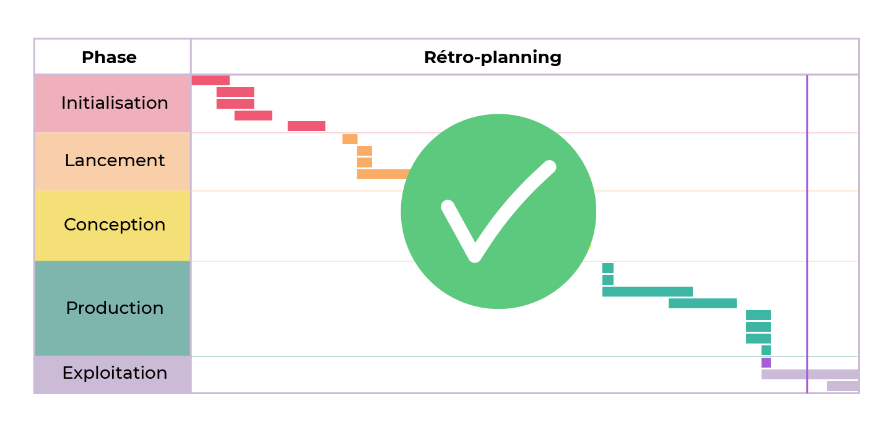

# Accompagnez votre équipe dans la conception d'un site web

Après avoir clarifié les besoins du client et formalisé le cahier des charges, la phase de conception est l'étape où les idées prennent forme. Bien que cette phase soit cruciale, le chef de projet prend un rôle d'accompagnateur, laissant les experts (graphistes, rédacteurs, etc.) concrétiser le projet.

## Préparation à la Conception

- **Maquettes de Moyenne Fidélité** : Si la phase de lancement a été bien menée, des maquettes de moyenne fidélité devraient déjà orienter le travail de conception.
- **Connaissance Multidisciplinaire** : Bien que la réalisation concrète relève des spécialistes, un chef de projet gagne à comprendre les bases du design, du marketing et du développement pour collaborer efficacement.

## Rôle du Chef de Projet en Conception

- **Facilitateur et Superviseur** : La posture du chef de projet évolue vers celle d'un facilitateur, veillant à l'avancement sans intervenir outre mesure.
- **Équilibre Intervention** : Trouver le juste milieu entre laisser-faire et interventionnisme est clé pour maintenir la qualité, le respect des délais et des coûts.
- **Autonomie de l'Équipe** : Encourager l'autonomie des équipiers augmente leur satisfaction et la qualité des livrables.

## Gérer les Incidents et Optimisations

- **Optimisation Excessive (Overkill)** : Veillez à ne pas perfectionner un livrable au-delà des besoins réels, au risque de retarder le projet.
- **Glissement de Portée (Scope Creep)** : Soyez vigilant pour éviter de produire des éléments non prévus dans le cahier des charges, qui pourraient allonger le projet sans compensation.

## Conseils pour la Phase de Conception

- **Clarification Continue** : Répétez et clarifiez régulièrement les attentes et les spécifications pour éviter les erreurs communes comme l'optimisation excessive et le glissement de portée.
- **Confiance et Qualité** : Instaurer un climat de confiance encourage l'excellence et l'engagement de l'équipe vers la réussite du projet.

En somme, la phase de conception est un moment où le chef de projet doit veiller à l'équilibre entre guidance et autonomie, tout en prévenant les risques d'optimisation excessive et de glissement de portée, pour assurer la réalisation conforme aux attentes du client.

# Pilotez la production d'un site web

Avec les phases d'initialisation, de lancement, et de conception derrière vous, le projet entre en phase de production. C'est le moment où les développeurs transforment les maquettes en un site web fonctionnel, en respectant le cahier des charges. Cette étape est cruciale : le succès du projet repose sur la capacité de l'équipe à intégrer et programmer les fonctionnalités du site.

## Connaissance en Codage pour un Chef de Projet

Bien que la maîtrise du codage ne soit pas obligatoire, elle est fortement recommandée. Comprendre les bases du développement vous permet de mieux communiquer avec votre équipe technique et d'assurer que le projet respecte les exigences de qualité.

## Gérer la Pression et les Délais

La pression s'accroît à mesure que la deadline approche. Pour éviter le stress inutile, qui peut mener à des erreurs, il est crucial de surveiller l'avancement du projet et de détecter tout retard potentiel dès que possible. Une gestion anticipative des retards permet d'ajuster les ressources sans recourir à des mesures extrêmes comme des heures supplémentaires de dernière minute.

## L'Importance des Tests

Les tests sont essentiels pour garantir la conformité du site aux spécifications du cahier des charges. Détecter et corriger les erreurs avant la livraison évite des complications contractuelles et maintient la satisfaction du client. Intégrez des sessions de tests régulières, adaptées à la complexité du projet, pour identifier et résoudre les problèmes efficacement.

## Pour résumer

La phase de production est la dernière étape avant la livraison du site. Une communication efficace avec l'équipe technique, une gestion proactive des délais et un engagement rigoureux envers les tests sont les clés pour réussir cette phase critique et livrer un site qui répond aux attentes du client.

# Supervisez la phase d'exploitation du projet

Le jour de la livraison est un moment clé dans la vie d'un projet, marquant la transition de la phase de production à celle d'exploitation du site. C'est un jour souvent attendu avec impatience par le commanditaire et avec une certaine appréhension par les prestataires, car il s'agit de la dernière occasion de confirmer que le travail réalisé répond aux attentes du client.

## La Livraison du Projet : Assurer la Satisfaction Client

Le moment tant attendu de la livraison du projet est enfin là. Après des semaines ou des mois de travail acharné, c'est l'occasion de présenter le fruit de vos efforts au client. Cependant, même si le respect du cahier des charges vous donne confiance, gardez votre concentration jusqu'à confirmation de la satisfaction client.

### Focus sur la Satisfaction Client

La réussite de cette étape se joue sur deux scénarios possibles :

- **Performance Supérieure aux Attentes** : Le client est satisfait.
- **Performance Inférieure aux Attentes** : Le client est insatisfait.

Un projet bien exécuté mais mal présenté peut laisser une impression de mécontentement. Présentez donc votre travail de manière à en valoriser chaque aspect.

### Formation du Client

Pour encourager le client à s'approprier le site :

- **Formez-le** à l'utilisation du site pour transformer toute appréhension en enthousiasme.
- **Partagez votre passion** pour le produit pour susciter son intérêt et son affection pour le site ou l'application.

### Recette Fonctionnelle

Proposez une recette fonctionnelle pour que le client puisse vérifier la conformité du site :

- **Cahier de Recette** : Listez tous les tests à réaliser.
- **Protocole de Recette** : Détaillez comment remonter les anomalies.
- **Planning de Recette** : Convenez d'une période de test sans surcoûts pour la correction des anomalies.

### Phase d'Exploitation

Une fois la satisfaction client assurée, le projet entre en phase d'exploitation. Cette phase peut inclure :

- **Contrat d'Assistance et de Maintenance** : Beaucoup d'agences proposent ces services à la livraison pour une gestion continue du site.
- **Opportunités de Vente Additionnelle** : L'expérience acquise avec le client vous place dans une position idéale pour identifier et proposer de nouveaux services.

La livraison est un moment crucial, non seulement pour valider la réussite du projet mais aussi pour renforcer la relation avec le client, ouvrir la porte à des services complémentaires et s'assurer de sa pleine satisfaction.

Lorsque vous aurez rempli tous vos engagements, assurez-vous que le client tienne les siens en vous payant en temps et en heure.

## Clôture du Projet : Réaliser un Bilan

À la fin de chaque projet, il est essentiel de prendre le temps de faire le point. Ce bilan permet d'évaluer la performance globale du projet, notamment en termes financiers.

### Procédure de Bilan

- **Comptabilisation Précise** : Assurez-vous d'avoir un suivi détaillé des dépenses tout au long du projet pour faciliter cette étape.
- **Comparaison Budgétaire** : Mettez en parallèle votre budget initial avec les dépenses effectives.

### Interprétation des Résultats

- **Dépassement Budgétaire** : Si les coûts réels excèdent les prévisions, votre marge commerciale se trouve impactée.
- **Économie de Ressources** : À l'inverse, une utilisation plus efficiente des ressources que prévu peut augmenter votre marge.

Ce bilan n'est pas seulement une formalité financière ; il offre aussi une opportunité de réflexion sur la gestion du projet et l'efficacité des méthodes employées. Il permet d'identifier les réussites à répliquer dans les projets futurs et les erreurs à éviter.

## Pour résumer

* La livraison n'est pas exactement la fin du projet mais c'est tout de même un grand jour.
* Satisfaction client = performance du prestataire – attentes du client
* Si vous avez respecté les exigences du client, assurez-vous qu'il respecte les vôtres en termes de paiement. Si vous avez été ponctuel, vous pouvez aussi exiger la ponctualité.
* Suivez l'évolution de vos dépenses tout au long du projet pour pouvoir facilement faire le bilan à la fin. 