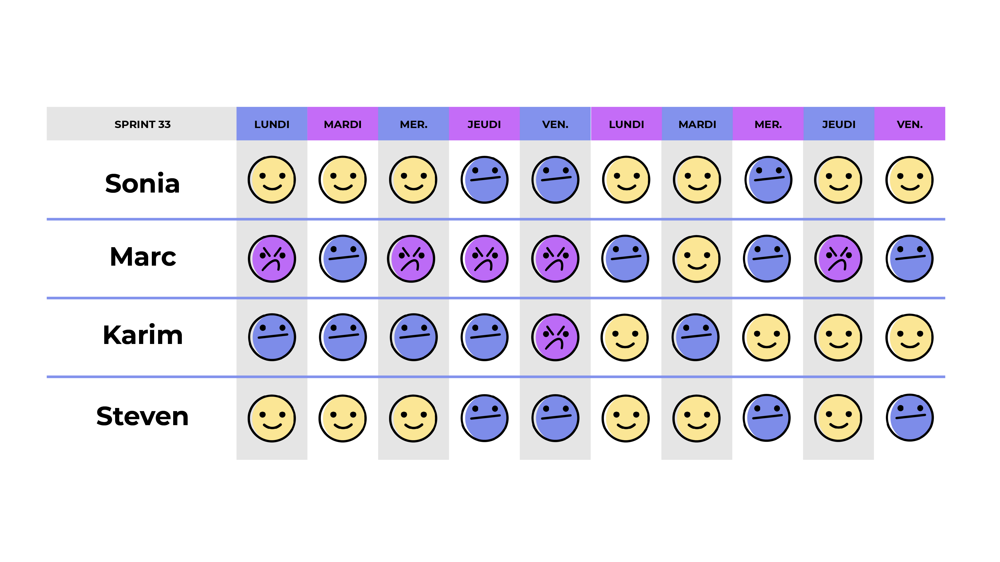
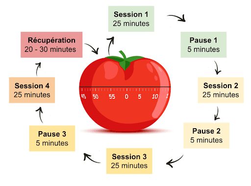
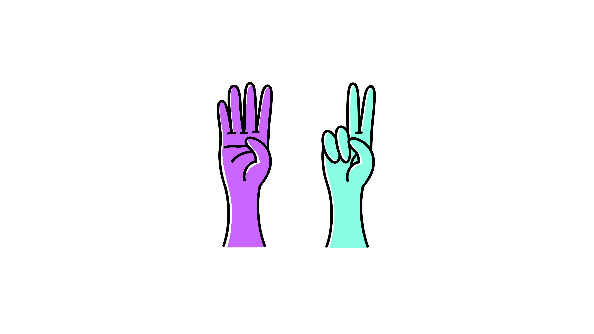
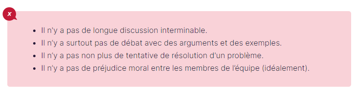

# Découvrez l'importance de l'esprit d'équipe en gestion de projet agile

---
⏱️ **Durée estimée :** 40 minutes (lecture + exercices équipe)
📋 **Prérequis :** Notions d'agilité, expérience de travail en équipe
🎯 **Objectifs :**

- Comprendre les valeurs du Manifeste Agile
- Maîtriser le modèle de Tuckman pour les équipes
- Identifier les dynamiques humaines en projet
- Appliquer l'intelligence collective

**TL;DR :** Ce chapitre explore la formation d'équipes agiles et les étapes de développement selon le modèle de Tuckman
---

[[_TOC_]]

Dans le contexte de la gestion de projet, la dynamique humaine est cruciale. Les attentes d'innovation du client, la tendance du chef de projet à s'en tenir au connu, et l'équilibre que l'équipe cherche à maintenir entre les deux posent des défis uniques. La méthode séquentielle peut être inadéquate pour des besoins évolutifs, alors qu'une approche agile offre la flexibilité nécessaire. L'agilité invite à l'implication du client et à une adaptabilité accrue. Cette section explore comment l'agilité peut adresser ces enjeux.

La gestion de projet agile met l'accent sur l'importance de l'**esprit d'équipe** et des **interactions humaines**. Elle s'aligne sur les valeurs du Manifeste Agile, qui sont les suivantes :

- Les individus et les interactions plutôt que les processus et les outils.
- Les produits de travail plutôt qu'une documentation complète.
- La collaboration avec le client plutôt que la négociation d'un contrat.
- La réponse au changement plutôt que le suivi d'un plan.

L'approche valorise l'"intelligence collective" et s'appuie sur des modèles tels que les "étapes du développement de l'équipe" de Tuckman pour améliorer la dynamique de l'équipe. Ce module de cours OpenClassrooms donne un aperçu de la manière de favoriser un environnement d'équipe solide dans un cadre agile.

## Facteur Humain et Gestion de Projet

### Mise en situation complexe

- **Le client** souhaite une balançoire “innovante”. Il propose la conception ci-dessous. Avec ce produit, il veut se démarquer de la concurrence ; mais les utilisateurs de la balançoire seront-ils vraiment satisfaits par une superposition de trois planches ? L'équipe parviendra-t-elle à traduire l'idée du client en balançoire fonctionnelle ?
- **Le chef de projet**, quant à lui, tend à rapprocher le besoin du client d’un produit qu'il connaît et dont il maîtrise déjà la conception. Deux cordes et une planche forment une balançoire standard ! Cette solution sera-t-elle assez “innovante”, et donc satisfaisante pour le client ?
- **L’équipe** tend donc vers un compromis entre les besoins exprimés par le client, les instructions du chef de projet et sa propre vision du produit. Le projet devra-t-il être aussi complexe ?
- **Le livrable** est présenté au client à la fin du projet. Une maquette incomplète ou un prototype approximatif permettent une avancée très rapide ! Le client et l'utilisateur auront-ils toujours la même vision du produit au cours de son développement ?
- **La promesse commerciale** et la stratégie marketing sont à la hauteur de ce que le client va payer. La balançoire est luxueuse et son "innovation" réside surtout dans son confort ! La gestion de projet devra-t-elle se limiter à valoriser les avantages concurrentiels du produit ?
- **L'utilisateur** voulait une balançoire sans prétention. Il souhaitait quelque chose de simple, amusant et économique ! Les facteurs de réussite d’un projet seront-ils seulement observés après le déploiement du produit ?

### Réalité de la Gestion de Projet

La méthode en cascade échoue souvent face à l'imprévu. L'agilité, par ses itérations et son inclusion du client, offre une réponse flexible aux changements et une meilleure satisfaction des besoins.

## L'Esprit Agile et le Manifeste

L'agilité en gestion de projet a été révolutionnée en 2001 avec le Manifeste Agile, privilégiant une approche pragmatique et adaptative. Ce changement vers plus d'empirisme reconnaît que la rigidité des méthodes classiques ne convient pas aux organisations dynamiques. Le Manifeste et ses 12 principes insistent sur la flexibilité, la réactivité, la transparence et l'anticipation.

### Les Valeurs du Manifeste Agile

1. **Individus et interactions :** Les projets sont le reflet direct des équipes qui les portent. L'accent est mis sur l'importance cruciale des interactions humaines et la collaboration sur les processus et les outils.
2. **Produits opérationnels :** L'approche agile privilégie l'opérationnel avec une gestion autonome des équipes, mettant l'accent sur la livraison continue de valeur au client.
3. **Collaboration client :** Le Manifeste encourage une collaboration étroite avec le client, favorisant les ajustements contractuels au profit de la réussite du projet.
4. **Acceptation du changement :** La capacité d'adaptation au changement est cruciale, en réponse à un marché en évolution rapide et des technologies avancées.

Le Manifeste, initialement conçu pour le développement logiciel, est maintenant appliqué dans divers secteurs, prônant l'adaptabilité comme clé de la survie et du succès.

## L'intelligence collective

Comment former votre équipe et l’amener à maturité ? La première phrase de l’article Wikipédia consacré à [l’intelligence collective](https://fr.wikipedia.org/wiki/Intelligence_collective) est un bon début de réponse :

> L'intelligence collective désigne les capacités cognitives d'une communauté résultant des interactions multiples entre ses membres.

L'esprit d'équipe agile tire parti de l'intelligence collective, similaire à celle observée chez les fourmis ou les abeilles, pour booster la performance organisationnelle.

En nous appuyant sur les études de Bruce Wayne Tuckman, nous adoptons une approche de "team-building" qui suit des étapes clés :

- **Forming (Formation)** : Familiarisation et acceptation mutuelle au sein de l'équipe.
- **Storming (Tension)** : Positionnement des membres de l'équipe, confrontation et résolution des conflits.
- **Norming (Régularisation)** : Création d'un environnement collaboratif où la confiance et les objectifs communs émergent.
- **Performing (Exécution)** : Interdépendance, autonomie et compétence des membres menant à une gestion de projet efficace.

Ces phases aident à construire une équipe soudée, autogérée, et performante sans recourir à l'autoritarisme.

# 2 Formez votre équipe

Dans la phase initiale "Forming" du modèle de Bruce Tuckman, l'équipe semble calme mais est en réalité en pleine évaluation mutuelle. Cette phase critique nécessite une observation attentive. L'équipe se forme, évaluant les relations et les compétences de chacun, ce qui définira comment ils travailleront ensemble. Il est essentiel de dissiper les incertitudes pendant cette période fondamentale.

## Accordez du temps à la formation de l'équipe

En tant que chef de projet ou coach agile, votre rôle est d'orienter et de soutenir l'équipe :

- **Définir les Objectifs :** Clarifiez les buts de l'équipe et les objectifs du projet pour fournir une direction précise.
- **Rôles des Équipiers :** Assister chaque membre de l'équipe dans la définition de son rôle.
- **Création de Liens :** Encouragez la formation de relations solides entre les membres de l'équipe.
- **Support aux Initiatives :** Soutenez activement les membres qui proposent des idées et des solutions.
- **Formation :** Proposez des opportunités de formation, tant théoriques que pratiques.

Favorisez un climat de confiance dès le début pour établir une dynamique de groupe positive et une forte cohésion d'équipe.

## Le Niko-Niko pour mesurer la santé de la vie d'équipe

La pratique du Niko-Niko, introduite par Akinori Sakata, est une méthode agile visant à capturer et visualiser le bien-être quotidien de l'équipe à l'aide de symboles ou de gommettes colorées sur un tableau visible par tous. Cette approche permet d'objectiver les états d'âme et la motivation, des aspects souvent subjectifs, offrant ainsi un aperçu précieux sur le climat général de l'équipe au fil du projet.  Le Niko-Niko incarne l'essence de la gestion empirique des projets selon Tom Gilb: la quantification des éléments auparavant considérés comme non quantifiables. Gilb soutient qu'il est toujours plus bénéfique de quantifier, même imparfaitement, plutôt que de ne pas quantifier du tout, facilitant ainsi la mesure de concepts subjectifs tels que le moral ou la motivation de l'équipe.

## Ne mettez pas les membres de votre équipe en concurrence les uns avec les autres

Le Niko-Niko est conçu par et pour l'équipe, incarnant un principe de mesure collective plutôt que de supervision paternaliste. Il encourage à adopter une approche fraternelle dans les interactions d'équipe, soulignant l'importance de la collaboration et du respect mutuel dans le processus agile.

> Le principe de Gilb ne dit pas que définir un nouvel indicateur est toujours une bonne chose, ni que ces indicateurs doivent mettre vos collaborateurs en concurrence.

# 3 Lancez votre travail en équipe

La phase "Storming" est cruciale pour l'évolution d'une équipe, marquée par des conflits et des tensions. Il est essentiel d'adopter une approche non autoritaire, favorisant plutôt l'écoute et la résolution constructive des différends pour maintenir l'unité et encourager une vision partagée du projet. Cette étape, bien que délicate, est nécessaire pour forger la cohésion et définir les dynamiques de groupe.

## Gérer la Phase de "Storming"

Aider l'équipe à maintenir une bonne ambiance de travail

- Encourager **écoute**, **compréhension** et **respect** mutuels.
- Établir un environnement de **confiance**, **tolérance**, et **empathie**.
- Promouvoir le **respect**, l'**écoute active**, et le **dialogue**.
- **Identifier** clairement les problèmes et **initier des solutions**.
- **Réduire les tensions** et **réguler les échanges**, en permettant à chacun de s'exprimer librement.
- Être **assertif** tout en restant à l'écoute des membres de l'équipe, **gérant les conflits** rapidement pour éviter leur envenimation.

## Le time-boxing pour maximiser l'efficacité de l'équipe

Le "Time Boxing" est une technique agile pour définir et limiter le temps dédié à certaines tâches. Elle se structure autour de huit étapes clés pour l'intégrer efficacement dans la gestion de projet. Cette méthode aide à focaliser l'effort sur l'essentiel, réduisant les réunions inutiles et optimisant le temps de gestion du projet. Pour débuter, la technique Pomodoro est fortement recommandée, offrant un bon équilibre entre travail concentré et pauses courtes, facilitant l'adaptation et l'efficacité de l'équipe.

1. **Expliquer l'objectif** aux participants.
2. **Définir les livrables** attendus.
3. **Indiquer la démarche** à suivre.
4. **Maîtriser la répartition du temps**.
5. **Désigner un gardien du temps** (Time Keeper).
6. **Dérouler les activités** prévues.
7. **Vérifier l'atteinte des objectifs**.
8. **Évaluer la satisfaction** des participants.

Favorisant la concentration et l'efficacité, cette pratique est un levier clé pour une gestion de projet agile et performante.

La technique Pomodoro suggère des sessions de travail de 25 minutes, entrecoupées de courtes pauses. Cet exercice, conçu pour être ludique et sans esprit de compétition, facilite l'adoption progressive de cette méthode agile. Avec de la pratique, il est possible d'ajuster la durée des sessions pour s'adapter à divers cadres temporels, des journées entières à plusieurs semaines, optimisant ainsi la productivité et le bien-être de l'équipe.

## Faire le point après chaque time-boxe

Après chaque session de travail chronométré, effectuez un bilan pour déterminer si les objectifs sont atteints. Évaluez si les tâches fixées ont été complétées entièrement ou partiellement, en visant une perspective de réussite claire (0 % ou 100 %). Cette approche vous aide à mesurer précisément l'avancement et à ajuster les efforts pour les sessions futures.

# 4 Régularisez le travail de votre équipe

La troisième étape du modèle de constitution d’équipe de Tuckman (Norming/régularisation) est une phase où vous serez peut-être tenté de prendre des décisions à la place de votre équipe... Attention ! :triumph:

## Rester \*\*facilitateur \*\* et laissez faire

Faciliter la vie de l'équipe est essentiel. Instaurez des règles communes, recherchez le consensus et créez un langage partagé pour un environnement harmonieux

- **Établissement de Règles Communes :** Créez un ensemble de principes acceptés par tous pour un cadre de travail harmonieux.
- **Recherche de Consensus :** Encouragez l'équipe à trouver des accords qui favorisent la collaboration.
- **Création d'un Langage Commun :** Développez un ensemble de symboles et termes partagés pour faciliter la communication.

### Assurer une Collaboration Efficace

- **Discipline d'Équipe :** Aidez à maintenir des horaires et des livrables précis.
- **Rigueur :** Encouragez l'objectivation des ressentis et l'explicitation des idées.
- **Résolution de Conflits :** Continuez à aider l'équipe à gérer les désaccords de manière constructive.

### Création d'un Environnement de Travail Agile

- Que ce soit en open space ou non, fournissez les moyens à chaque membre de contribuer à l'environnement de travail commun.
- **Environnement Agile :** Établissez une "War Room" ou "Digital Workplace" où l'équipe peut opérer sans perturbations.

## Faire évaluer l'utilité des réunion

Le ROTI est une technique agile utilisée pour évaluer l'efficacité d'une réunion en demandant aux participants de noter le retour sur le temps investi. Allouer 60 secondes à la fin de chaque réunion pour cette évaluation rapide peut améliorer significativement la qualité et la pertinence des réunions futures.

{width="460" height="259"}

### Évaluation ROTI des Réunions

- **1 doigt :** Inutile, perte de temps.
- **2 doigts :** Utile mais ne justifie pas la durée.
- **3 doigts :** Moyenne, neutre.
- **4 doigts :** Bonne, temps bien investi.
- **5 doigts :** Excellente, très bénéfique.

### Pour Améliorer

La règle veut qu’on interroge seulement les participants qui ont noté 1 et 2 doigts, mais je vous conseille plutôt de poser une seule et même question aux membres de votre équipe : « Qu'est-ce qui pourrait être fait pour augmenter ma note d'un point ? ». :thinking:

## Les points d'attention

Après l’évaluation du ROTI, vous devez simplement prendre acte de la note moyenne :

Cette pratique est une parfaite initiation à la transparence et au management visuel. En gestion de projet, le ROTI nous invite à rester humbles. :bow:

# 5 Performez en équipe

Dans la quatrième étape du modèle de constitution d’équipe de Bruce Tuckman, appelée Performing ou Exécution, vous n'êtes plus aussi enclin à renforcer vos liens avec l'équipe, à maintenir une présence régulière ou à dépendre fortement de chaque membre. Au lieu de cela, vous prenez du recul et vous analysez de manière continue le travail de votre équipe afin de partager vos observations. C'est une phase où l'accent est mis sur l'exécution efficace des tâches et la réalisation des objectifs, tout en permettant à chaque membre de l'équipe de fonctionner de manière autonome.

## Équipe autonome

Si vous avez bien appliqué les pratiques agiles des trois chapitres précédents, cette dernière étape doit correspondre à celle d'un travail effectif de votre équipe. Les bases de fonctionnement qui ont été mises en place sont pérennes, et votre équipe coopère pour atteindre ensemble les objectifs du projet. :dart:

Votre équipe peut maintenant résoudre ses problèmes toute seule ; cependant votre rôle reste crucial :

- Soyez la passerelle entre l’équipe et les parties prenantes du projet.
- Soyez le facilitateur de la prise de décision (aux niveaux supérieurs/inférieurs).

Lors de cette étape, vous ne devez plus vous impliquer directement dans les prises de décision. Les membres de l'équipe sont désormais autonomes et autogérés : ils travaillent ensemble et prennent leurs responsabilités sans vous. Mission accomplie ! :clap: Votre équipe agile est prête !

## Pilotage par les Résultats : outils de gestion de projet

Restez à l'affût des nouveaux logiciels qui favorisent le pilotage par **les livrables ou les résultats**. Cette approche, plus récente, offre des solutions plus agiles que la gestion traditionnelle des ressources. Le pilotage par les résultats se concentre sur les objectifs et les anticipations pour assurer la réussite du projet.

Lorsque votre équipe atteint un niveau de performance élevé et produit de manière systématique, il est temps d'envisager le déploiement d'outils dédiés à la gestion de projet. Voici une sélection de quelques options parmi les plus populaires :

- [Jira](https://www.atlassian.com/software/jira)
- [Trello](https://trello.com/)
- [Wrike](https://www.wrike.com/)
- [Asana](https://asana.com/)
- [Liste plus exhaustive ici](https://fr.wikipedia.org/wiki/Logiciel_de_gestion_de_projets)

En utilisant des outils d'analyse appropriés, vous pouvez identifier les causes des écarts, suivre leur évolution et découvrir des leviers d'action pour corriger le cours du projet. Cette approche vous permet de prendre des décisions éclairées basées sur les données. :rocket: #datadriven

Ici nous exploiterons les fonctionnalités de GitLab dans sa version gratuite (certes limité, mais à notre disposition). GitHub permet encore plus de chose

## Aider l'équipe à atteindre ses objectifs

Lorsque chaque membre est concentré sur **l’atteinte des objectifs** en tant qu’équipe :

- L’individu n’existe plus ou disparaît.
- Les membres de votre équipe ne dépendent pas d'un chef de projet.
- Les membres peuvent résoudre des problèmes sans manager.
- La supervision quotidienne de votre équipe n’est plus indispensable.

La réussite d'une équipe ne se décide pas simplement ! Le modèle de Tuckman représente une ressource inestimable pour former une équipe agile tout en tenant compte du tempo individuel de chaque membre. Que vous soyez Scrum Master, coach agile, manager, chef de projet, responsable, entrepreneur ou dirigeant d’entreprise, nous sommes tous des bénéficiaires lorsque les conditions optimales du travail collaboratif sont présentes.
