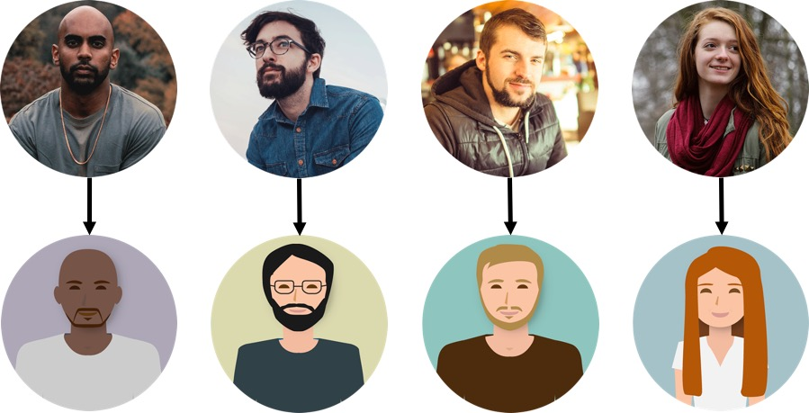
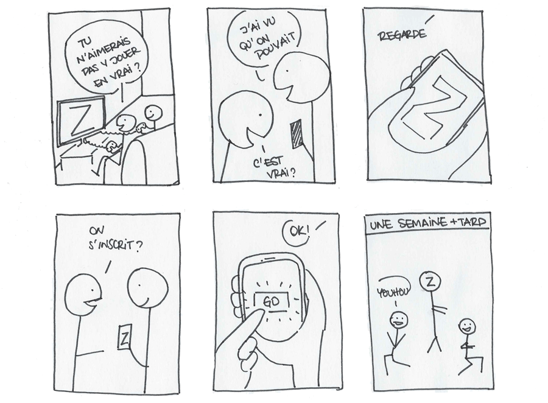

# Collectez les besoins utilisateurs

---
⏱️ **Durée estimée :** 45 minutes (lecture + exercices UX)
📋 **Prérequis :** Équipe constituée, bases d'UX design
🎯 **Objectifs :**

- Maîtriser les techniques de collecte des besoins
- Créer des personas représentatifs
- Réaliser des entretiens utilisateurs efficaces
- Concevoir des storyboards et parcours utilisateur

**TL;DR :** Ce chapitre détaille la collecte et l'analyse des besoins utilisateurs dans une approche agile centrée utilisateur
---

[[_TOC_]]

Après la constitution de votre équipe agile, nous allons voir l'importance du client, mais surtout de l'utilisateur final dans la gestion du projet.

# 1\. Collectez les besoins

**Mise en situation :** Vous êtes UX designer (concepteur-ice d'expérience utilisateur-ice) en charge de la refonte des visuels d'un outil digital. Son rôle est de créer une expérience capable de suciter l'émotion chez l'utilisateur. Pour y arriver, vous tiendrez compte tout autant des besoins **clients** que de ceux des **utilisateurs**.

## Les besoins du projet

La gestion de projets digitaux innovant amène souvent à être en contact à distance avec les clients et les utilisateurs, ce qui ne facilite pas l'évaluation du **niveau de maturité** de leurs demandes. Les communications par téléphone, visioconférences ou courriels n'étaient pas toujours efficaces pour recueillir tous les besoins d'un client.

### Poser des questions

Idéalement, premières rencontres en physique dans un **lieu neutre** (médiathèque, restaurant ...) pour instaurer une relation de confiance.

Objectif de la première rencontre : **faire parler le client !** et recueillir le plus d'information possible :

- Délai
- Budget
- Disponibilité
- Finalité
- Vision
- Évolution
- Inspiration
- Concurrence

Poser des **questions ouvertes**, où le client ne peut répondre par "oui" ou "non".

Écouter le client et **schématiser le projet** des le premier rendez vous (grandes feuilles blanches, feutres et stylos)

### N'accepter pas n'importe quel projet

Malgré l'excitation de réaliser un projet innovant et inconnu : il faut apprendre à refuser les **missions trop contraignantes**.

Ne gaspillez pas votre temps dans des projets qui ne vous inspirent pas. Le risque étant de passer plus de temps en réunion qu'en gestion. Priorisez les sollicitations professionnelles.

Red Flags :

- Personnes non coopératives
- Client avec une vision déjà trop figée de leur produit ou de la solution à concevoir et à développer Vous serez vite fixé en échangeant sur vos méthodes de travail.

### N'ayez pas peur de paraître débutant

Vous ne connaissez pas le procédé de votre client, ses besoins, sa culture d'entreprise, etc...

Demandez à votre client une synthèse écrite de ses besoins. Par l'analyse de son vocabulaire et du champ lexical employé, on peut lui proposer une direction plus précise. La réalisation d'une carte heuristique sur [coogle.it](https://coggle.it/) ou [nuagesdemots.fr](http://www.nuagesdemots.fr/) permet de mettre en évidence tous les enjeux du projet. Les livrables de l'expérience utilisateur vont vous permettre de diviser le projet en différentes propositions pour être sûr de répondre à toutes les attentes du client, éviter le hors sujet et avoir une gestion de projet cohérente. L'utilisation de carte mentales, d'entretien utilisateur, maquettes ou prototypes par exemple, permettent de garantir une bonne gestion avec le client.

## Les livrables du projet

Au cœur du _Manifeste Agile_ se trouve une préférence fondamentale : **mettre en avant les individus et leurs interactions plutôt que de se focaliser sur les processus et les outils**. Pour concrétiser cette philosophie dès votre première rencontre avec le client, vous pouvez préparer et partager trois types de livrables.

### :scroll: Les Histoires

Une expérience utilisateur marquante se raconte souvent à travers une bonne histoire. Ces récits, au-delà d'identifier des problématiques ou des opportunités, ont le pouvoir de rester gravés dans les mémoires et de stimuler l'engagement de votre équipe.

### :fire: Les Proverbes

L'usage de comparaisons, d'analogies et de métaphores, puisant dans le réservoir des références culturelles, se révèle extrêmement bénéfique. Cela aide à clarifier les objectifs et les enjeux d'un projet, facilitant ainsi la compréhension et l'adhésion tant du côté du client que de l'équipe.

### :pencil: Les Rapports

Articuler ses pensées par écrit est un puissant moyen de structuration et de clarification. Un rapport concis, révélant les résultats d'une analyse approfondie et proposant des recommandations précises, constitue un outil précieux pour la communication et la prise de décision.

## Résumé

Lors de votre premier rendez-vous avec le client, adoptez une approche stratégique et méthodique pour poser les fondations d'une collaboration efficace.

1. **Choix du Lieu** : Optez pour un espace neutre, propice à un échange ouvert et constructif.
2. **Communication** : Utilisez des questions ouvertes pour encourager le client à partager ses idées et ses besoins. Complétez cette démarche par des schémas explicatifs pour une meilleure visualisation du projet envisagé.
3. **Présentation des Méthodes de Travail** : En tant que coach agile, présentez les différentes méthodes collaboratives. L'objectif est de susciter l'intérêt et l'adhésion du client en lui montrant comment ces méthodes peuvent bénéficier à son projet.
4. **Implication du Client** : Engagez activement le client dans le processus par différentes activités :
   - Rédaction d'un résumé concis du projet.
   - Création d'une carte mentale pour structurer visuellement les idées.
   - Analyse du vocabulaire spécifique au projet pour assurer une compréhension commune.
5. **Livraison d'un Rapport** : Clôturez ce premier rendez-vous en remettant au client un rapport détaillé. Ce document doit résumer les discussions, les idées partagées, et proposer des pistes de réflexion pour les étapes suivantes.

Cette approche vise à établir une base solide pour un partenariat réussi, en mettant l'accent sur l'écoute, la participation active et la mise en confiance.

# 2\. Cartographiez le projet : L'Essence du Brainstorming dans la Gestion Empirique de Projet

Que vous travailliez seul ou en équipe, le brainstorming est un élément clé dans la gestion agile de vos projets.

## Les Besoins du Projet

Pour rester à la pointe de votre domaine, il est conseillé de consacrer quotidiennement une à deux heures à la veille sur des sujets qui vous passionnent, comme l'évolution des moteurs de recherche, l'impact de l'économie collaborative, ou encore les interactions entre médias de masse et réseaux sociaux. Les informations collectées, qu'elles proviennent du web ou de sources imprimées, enrichissent votre expertise professionnelle et deviennent des atouts inestimables dans la gestion de nouveaux projets. Restez "agile" pour répondre de manière innovante aux attentes de vos clients. :call_me:

### Imprégnez-vous du Sujet

Les outils tels que LinkedIn, Workplace, et Slack sont mes principales sources pour la veille, complétées par des abonnements à diverses newsletters, des lectures de publications locales et de magazines internationaux. Bien que je consomme peu de contenus télévisuels ou sur YouTube, je trouve de la valeur dans certaines émissions radio. Mon conseil : diversifiez vos sources tout en restant précis !

### Comment effectuer une veille efficace ?

- Évitez la dispersion et le surcharge d'informations.
- Recherchez des contenus pertinents rapidement.
- Définissez une problématique claire basée sur les besoins du client.

Par exemple, pour un projet visant à rendre l'univers des zombies à la fois ludique et convivial, combinez des mots-clés tels que “univers + zombie”, “zombie + ludique”, et “zombie + convivial” dans vos recherches. Utilisez des outils comme Google Trends ou Google Alerts pour affiner votre veille. :computer:

### Allez sur le Terrain

L'immersion et l'observation directe des utilisateurs dans leur environnement naturel sont cruciales pour comprendre les besoins réels liés à un produit ou service. Si les ressources sont limitées, optez au minimum pour des entretiens variés avec les utilisateurs, idéalement en visioconférence. :thumbsup:

### Vision d'Ensemble pour le Second Rendez-vous

Lors du second rendez-vous avec le client, une présentation détaillée est essentielle pour confirmer la direction du projet. Utilisez des outils comme Keynote, Microsoft PowerPoint, Google Slides, ou Prezi pour maintenir votre présentation à jour et éviter la prolifération de versions. La clarté de votre vision d'ensemble et la précision de votre feuille de route sont d'autant plus cruciales que le projet présente des inconnues. Accordez une attention particulière à ces documents, même en amont de la finalisation des devis.

## Les livrables du projet

La collaboration étroite avec le client est une pierre angulaire de l'approche agile. Pour honorer cet engagement, intégrez ces trois types de livrables dans votre processus.

### :computer: Les Présentations

Les diaporamas sont un excellent moyen de narrer une histoire, de présenter des données ou d'expliquer des concepts. Pour captiver votre audience et éviter l'ennui :

- **Soyez original** : Utilisez des designs uniques et des approches interactives.
- **Restez rigoureux** : Assurez-vous que le contenu soit précis, pertinent et bien structuré.

### :date: Les Plannings

Les agendas, les plans et les feuilles de route sont essentiels pour :

- **Guider l'équipe** : Ils clarifient les rôles, les responsabilités et les échéances.
- **Favoriser la transparence** : Ils permettent une vision claire de l'avancement du projet et facilitent l'alignement entre les attentes du client et les livrables de l'équipe.

### :earth_africa: Les Cartes

La cartographie des concepts est vitale pour :

- **Établir des Repères** : Identifiez les éléments clés du projet et leur interrelation.
- **Clarifier les Relations** : Comprenez comment les différentes parties du projet s'interconnectent.
- **Identifier les Priorités** : Distinguez les éléments critiques qui nécessitent une attention immédiate.
- **Décider des Actions à Entreprendre** : Avec une vue d'ensemble claire, prenez des décisions informées sur les prochaines étapes.

Ces livrables sont des outils puissants pour renforcer la collaboration avec le client, en assurant que tous les participants sont alignés et engagés vers un objectif commun.

# 3\. Menez des entretiens

Les entretiens avec des utilisateurs sont le meilleur moyen de fixer un cap en gestion empirique de projet.

## Comprendre les Besoins Réels

L'expérience m'a enseigné que les premières étapes d'un projet de refonte ne valorisaient pas suffisamment les entretiens utilisateur. Malgré l'analyse de sondages et une veille active sur les bonnes pratiques d'ergonomie web, ma compréhension des projets restait superficielle, me laissant parfois à court d'arguments pour convaincre les clients.

### L'enregistrement des Entretiens : Une Compétence Clé

J'ai rapidement compris que l'enregistrement des entretiens utilisateur était une compétence cruciale, permettant d'approfondir la compréhension des besoins et des attentes.

## Réalisation des Entretiens

Aujourd'hui, je m'engage à réaliser entre 5 et 15 entretiens semi-directifs par projet, chacun durant de 30 à 45 minutes. Ces entretiens qualitatifs offrent la flexibilité nécessaire pour explorer en profondeur les perspectives des utilisateurs, capturer leurs impressions et décoder leurs comportements.

### Techniques d'Entretien

- **Utilisation d'un Guide d'Entretien** : Préparation de questions permettant une réponse instinctive de l'utilisateur.
- **Connaissance Préalable de l'Utilisateur** : Comprendre le background de l'individu avant de plonger dans les questions.
- **Enregistrement des Réponses** : Conservation des réponses pour valoriser des citations et des verbatims lors de la présentation au client.

## Établissement du Guide d'Entretien

Le guide d'entretien est conçu en fonction des objectifs de l'enquête, permettant d'identifier des besoins non encore détectés et de comparer les résultats entre utilisateurs.

### Stratégies Clés

- **Questions Ouvertes** : Commencez par des questions larges pour mettre à l'aise et encourager la discussion.
- **Observation Attentive** : Notez les émotions, le ton, la posture, et d'autres indices non-verbaux.
- **Questions Précises** : Introduisez des ressources spécifiques (sites web, articles, prototypes) pour obtenir des feedbacks sur des fonctionnalités précises.

## Outils d'Enregistrement et de Montage

- **Loom** : Enregistrement des interactions des utilisateurs avec les applications ou sites web.
- **Zoom** : Partage d'écran à distance pour une observation en temps réel.
- **Animotica** : Montage vidéo.
- **YouTube** : Extraction de sous-titres.

## Conseils pour les Entretiens

- **Écoute Active** : Ne coupez jamais la parole, écoutez sans interpréter.
- **Relation de Complicité** : Adoptez une approche égalitaire pour favoriser la confiance et la franchise.
- **Utilisation d'Humour** : Détendez l'atmosphère en cas de malaise.

## Utilisation Stratégique des Entretiens

Les retours d'expérience recueillis lors des entretiens sont précieux pour étoffer vos propositions et argumenter efficacement auprès du client, notamment si celui-ci a tendance à s'appuyer exclusivement sur sa propre expertise.

### Storytelling

Transformez les résultats des entretiens en récits captivants, renforçant l'impact de vos présentations et facilitant l'adhésion du client à vos propositions.

En définitive, les entretiens utilisateurs sont une pierre angulaire de la gestion de projet, offrant une richesse d'informations inégalée pour orienter les décisions et stratégies de refonte.

## Livrables Essentiels pour Orienter Votre Projet

Dans le cadre d'une gestion de projet axée sur les retours utilisateurs, ces trois livrables jouent un rôle crucial en fournissant des orientations claires à votre équipe.

### :bar_chart: Les Sondages

Utiliser des sondages est une méthode efficace pour:

- **Découvrir des Besoins Cachés** : Des questions uniformes posées à un large éventail d'utilisateurs peuvent révéler des insights précieux, souvent inattendus.
- **Augmenter la Satisfaction Client** : En identifiant et en répondant à ces besoins, vous alignez mieux le produit ou le service avec les attentes des utilisateurs.

### :nut_and_bolt: Les Systèmes

La modélisation des systèmes inclut:

- **Représentation Visuelle** : Schématiser les objets et leurs interrelations clarifie la structure et les fonctionnalités pour toutes les parties prenantes.
- **Amélioration de la Compréhension** : Cette clarté visuelle facilite la prise de décision et l'alignement des équipes autour d'objectifs communs.

### :ocean: Les Flux

Cartographier les flux d'interaction des utilisateurs avec votre produit ou service permet de:

- **Visualiser les Procédures** : Identifier les "lignes de désir" naturelles des utilisateurs et les parcours qu'ils empruntent.
- **Mettre en Évidence les Avantages** : Démontrer pourquoi les solutions choisies par l'équipe répondent efficacement aux besoins et attentes des utilisateurs.

Ces livrables ne sont pas seulement des outils de travail; ils constituent une boussole guidant votre projet vers une destination claire, alignée avec les attentes des utilisateurs et les objectifs du client.

# 4\. Créez des personas

Les personas permettent de répondre à deux questions essentielles en gestion empirique de projet : Qui sont les utilisateurs et comment utilisent-ils mon produit ou service ?

## Les besoins du projet : Création de Personas en UX Design ; Une Méthode Essentielle

La méthode des personas est cruciale tant en marketing qu'en UX design, servant à représenter des groupes cibles ou des utilisateurs fictifs. Cette approche aide à aligner la conception de produits ou services sur les besoins réels des utilisateurs, en encourageant une compréhension approfondie et empathique de leur expérience.

### Identifiez les Utilisateurs “Extrêmes” et “Types”

- **Utilisateurs Extrêmes** : Distinguer les comportements variés en fonction de critères comme l'âge ou l'expérience digitale. Une enquête sociologique approfondie révèle des insights précieux pour concevoir des scénarios d'usage adaptés.
- **Utilisateurs Types** : Créer des archétypes basés sur des attentes communes permet d'humaniser l'utilisateur final et de faciliter le dialogue entre l'équipe et le client.

### Méthodologie de Création des Personas

1. **Collecte de Données** : Utilisez des entretiens individuels, sondages, appels téléphoniques, etc., pour recueillir un éventail d'informations sur les utilisateurs potentiels.
2. **Listez les Caractéristiques Déterminantes** : Définissez les aspects clés comme l'âge, les besoins, les habitudes, la navigation en ligne et l'expertise dans le domaine.
3. **Identification des Profils** : Synthétisez les données pour découvrir des groupes d'utilisateurs avec des comportements similaires, y compris des profils "double-face" qui se situent entre deux catégories distinctes.

### Développement des Personas

- **Nombre Idéal** : Commencez avec 3 à 5 personas pour les projets simples, pouvant aller jusqu'à 20 pour des projets plus complexes, en fonction des données recueillies.
- **Humanisation** : Attribuez un prénom, décrivez leur histoire personnelle en vous basant sur des faits réels pour susciter l'empathie de l'équipe de conception

  > _
  > Créer une caricature réaliste de vos utilisateurs grâce aux personas_
- **Utilisation Continue** : Affichez les personas dans l'environnement de travail pour inspirer et guider l'équipe tout au long du processus de conception.

### Avantages de la Méthode des Personas

- **Compréhension Partagée** : Facilite une vision commune des utilisateurs au sein de l'équipe.
- **Priorisation des Solutions** : Oriente les décisions de conception en fonction des besoins spécifiques des personas.
- **Personnalisation** : Donne un visage et une histoire aux utilisateurs fictifs, rendant les solutions plus concrètes et empathiques.

En UX design, contrairement au marketing, les personas synthétisent diverses caractéristiques pour créer une représentation réaliste des utilisateurs. Pour la création visuelle de personas, des outils en ligne comme celui proposé par HubSpot peuvent être particulièrement utiles : [Créer mon Persona HubSpot](https://www.hubspot.fr/make-my-persona).

## Les Livrables Clés pour Maximiser l'Impact des Personas dans votre Projet

Les personas jouent un rôle crucial dans la définition et l'orientation des produits ou services. Pour exploiter pleinement ce potentiel, associez-les avec deux autres livrables essentiels.

### :busts_in_silhouette: Les Personas

- **Fondation** : Ils incarnent la synthèse des objectifs et comportements des utilisateurs cibles, servant de rappel constant que le produit ou service n'est pas conçu exclusivement pour l'équipe de développement ou le client.
- **Principe** : « Vous n'êtes pas les (seuls) utilisateurs ».

### :page_with_curl: Les Scénarios

- **Contextualisation** : Placent les personas dans des situations concrètes, illustrant comment ils interagiraient avec le produit ou service dans la réalité.
- **Application** : Ces scénarios aident à envisager de manière pragmatique la réponse du produit ou service aux besoins spécifiques des utilisateurs.

### :bookmark_tabs: Les Listes d'Exigences

- **Transition** : Transformez la conception en développement concret en listant les exigences spécifiques dictées par les comportements des personas.
- **Guidage** : Ces listes servent de référence pour le développement, assurant que les fonctionnalités conçues correspondent précisément aux besoins identifiés durant la phase de conception.

En combinant ces trois livrables — personas, scénarios, et listes d'exigences — vous créez une structure solide pour le développement de votre projet, en vous assurant que le produit final répond véritablement aux attentes et aux besoins des utilisateurs finaux.

# 5\. Résumez l'UX du projet en créant un story-board

La réalisation du story-board est la dernière compétence que vous devez acquérir en UX design afin de faciliter votre gestion empirique de projet

## Les besoins du projet - Le Story-Board en UX Design : Un Outil Narratif Puissant

La tradition du story-board, empruntée au cinéma, trouve une application précieuse en UX design, permettant de visualiser l'expérience utilisateur avant même le début du développement. Cet outil narratif enrichit la communication au sein des équipes et avec le client, offrant une représentation vivante des besoins et interactions des utilisateurs avec le produit ou service envisagé.

### Mettre en Scène l'Expérience Utilisateur

- **Visualisation** : Représentez vos personas dans des scénarios variés, racontant visuellement leurs interactions avec le produit ou service.
- **Contextualisation** : Illustrez les circonstances d'utilisation (domicile, déplacement, etc.) pour ancrer les solutions proposées dans la réalité des utilisateurs.

### Création d'une Bande Dessinée

- **Format** : Adoptez une structure de 5 à 9 vignettes, disposées en une ou plusieurs bandes horizontales, pour narrer les étapes clés de l'interaction utilisateur-produit.
- **Simplicité** : Utilisez des éléments graphiques basiques et universels, évitant les détails complexes de l'interface utilisateur.

### Conseils de Conception

- **Vocabulaire Visuel** : Positionnez vos dessins dans la zone de simplification symbolique, comme décrit par Scott McCloud, favorisant la compréhension rapide et intuitive.
- **Accessibilité** : Nul besoin d'expertise en dessin, utilisez des outils comme Prezi, Piktochart, ou AutoDraw pour assembler des story-boards convaincants.

### Partage et Utilisation du Story-Board

- **Intégration** : Affichez le story-board à côté des personas dans l'espace de travail pour une référence constante. 
- **Collaboration** : Utilisez le story-board comme un catalyseur de discussion, d'idéation et de résolution de conflits au sein de l'équipe.

En incorporant le story-board dans le processus de conception UX, vous créez une fondation visuelle forte pour le projet, favorisant une compréhension commune et une orientation partagée vers la satisfaction des besoins des utilisateurs.

## Les Livrables Clés pour Orienter et Affiner Votre Projet

Dans le cadre d'une gestion de projet agile, certains livrables jouent un rôle essentiel en guidant l'équipe à travers les différentes phases de conception et de développement. Ces documents servent de points de référence pour maintenir le cap et assurer que le produit final répond aux attentes des utilisateurs et du client.

### :notebook_with_decorative_cover: Le Story-Board

- **Fonction** : Sert de fil rouge narratif, illustrant les interactions entre les utilisateurs et le produit ou service.
- **Objectif** : Aide à visualiser le contexte d'utilisation et à anticiper les besoins et réactions des utilisateurs.

### :newspaper: Le Wireframe

- **Définition** : Une maquette schématique focalisée sur la structure, l'organisation des éléments et les interactions utilisateur.
- **Rôle** : Constitue une étape cruciale avant de s'engager dans les aspects esthétiques tels que le choix des couleurs ou des polices, en mettant l'accent sur la fonctionnalité et l'ergonomie du produit.

### :bulb: Les Prototypes

- **Variété** : Peuvent être sous forme de modèles papier ou informatiques, allant du mockup simple à des versions plus élaborées permettant des interactions réelles.
- **But** : Permettent de tester l'engagement des utilisateurs et du client, offrant un aperçu concret de ce à quoi le produit ou service va ressembler et fonctionner.

Ces trois livrables sont indispensables pour une gestion de projet efficace, offrant une base solide pour la communication interne et externe, la prise de décision et le test des concepts avant leur réalisation définitive. En les intégrant judicieusement dans le processus de développement, vous pouvez optimiser les chances de succès du projet en répondant précisément aux besoins identifiés lors des étapes de recherche et de conception.
