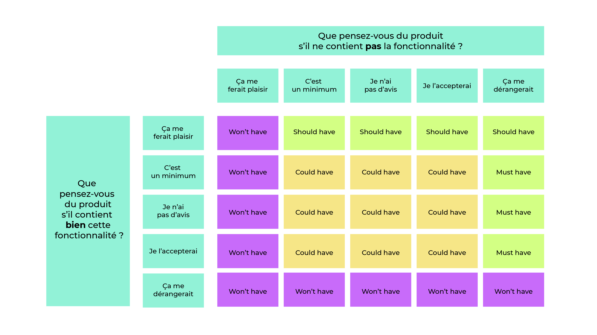
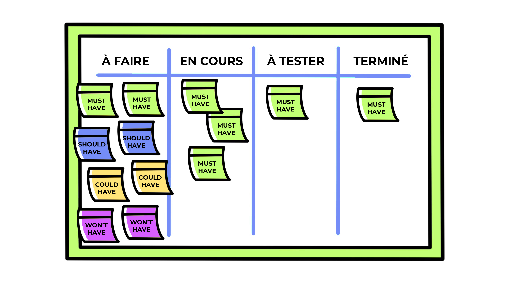
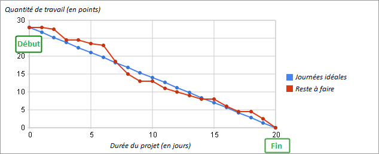

# Utilisez les outils visuels agiles

---
⏱️ **Durée estimée :** 50 minutes (lecture + manipulation outils)
📋 **Prérequis :** User stories définies, équipe agile formée
🎯 **Objectifs :**

- Maîtriser la rédaction et évaluation des User Stories (INVEST)
- Utiliser le Product Backlog pour prioriser
- Implémenter Kanban pour le workflow
- Analyser la vélocité avec les Burndown Charts

**TL;DR :** Ce chapitre présente les outils visuels essentiels de l'agilité : Backlog, Kanban et métriques de suivi
---

[[_TOC_]]

## Inspecter les User Stories

Apprendre à reconnaître et évaluer les User Stories est essentiel en développement agile. Ces récits, formulés dans un langage simple, décrivent les fonctionnalités nécessaires du projet du point de vue de l'utilisateur.

### Pour l'Équipe Agile

Après avoir collecté les besoins des utilisateurs, il est crucial de les transcrire en User Stories claires et précises pour éviter toute ambiguïté. Une User Story efficace doit inclure trois éléments clés :

1. **Le Contexte** : _En tant que \[utilisateur\],_
2. **La Fonction** : _je veux \[fonctionnalité\],_
3. **Le Bénéfice** : _afin de \[raison\]._

Par exemple, "En tant que joueur, je veux visualiser le plan du jeu d'évasion afin de m'orienter."

### Pour le Coach Agile

Les User Stories sont rassemblées dans le carnet du projet (product backlog), sous la responsabilité du client ou de son représentant. Bien que le coach agile ne rédige pas les User Stories, il doit en évaluer la qualité à travers la grille de critères INVEST, qui garantit leur pertinence :

- **Independent** (Indépendant)
- **Negotiable** (Négociable)
- **Valuable** (Utile)
- **Estimable** (Estimable)
- **Small** (Concis)
- **Testable** (Testable)

L'attention portée sur le critère **Small** (Concis) est particulièrement importante pour encourager l'équipe à bien découper les User Stories.

### Motiver le Découpage des User Stories

Pour encourager votre équipe à découper efficacement les User Stories, mettez en avant la satisfaction d'atteindre rapidement des objectifs concrets. Chaque tâche représente un niveau élémentaire de découpage pour une User Story, facilitant ainsi le suivi du progrès et la compréhension du projet par le client.

### Le Product Backlog

Le Product Backlog est dynamique et évolutif, adaptant son niveau de détail en fonction de l'imminence de la réalisation des tâches. Il est crucial de veiller à ce que les tâches soient définies selon les critères SMART pour assurer leur faisabilité et pertinence :

- **Specific** (Spécifique)
- **Mesurable** (Mesurable)
- **Achievable** (Atteignable)
- **Relevant** (Pertinent)
- **Time Bound** (Limité dans le temps)

L'usage des critères INVEST et SMART, proposés par Bill Wake, facilite la gestion agile du projet en assurant que chaque User Story et tâche contribuent efficacement à la réalisation des objectifs.

### En Résumé

La rédaction et l'évaluation des User Stories et des tâches sont des étapes clés dans la gestion agile d'un projet. En utilisant les grilles de critères INVEST et SMART, vous optimisez l'organisation et l'efficacité de votre équipe, tout en clarifiant les attentes et besoins du projet.

## Évaluation du Product Backlog

Dans le développement agile, le Product Backlog est un composant central qui agit comme le cœur de la planification du projet. Ce chapitre détaille comment évaluer et prioriser efficacement le Product Backlog pour assurer le succès du développement.

### Pour l'Équipe Agile

Le Product Backlog transforme les intentions du projet en directives claires, couvrant les besoins, les améliorations et les corrections nécessaires. Il doit être partagé avec le client et toutes les parties prenantes, comprenant des User Stories et des tâches classées et évaluées pour simplifier la gestion quotidienne.

- **Nature Évolutive** : Le Product Backlog n'est jamais fixe; il est constamment révisé pour y ajouter des détails ou ajuster les priorités.
- **Objectif de Valeur** : Chaque tâche doit être analysée en fonction de la valeur qu'elle apporte, en utilisant des critères pondérés pour évaluer les gains attendus.

La mise à jour régulière du Product Backlog et l'évaluation continue de la valeur des tâches sont cruciales pour maintenir l'alignement avec les objectifs du client et les attentes des utilisateurs.

### Pour le Coach Agile

#### Priorisation avec la Méthode MoSCoW

Cette méthode aide à établir les priorités des fonctionnalités dans le Product Backlog en les classant en :

- **Must have** (Indispensables)
- **Should have** (Importantes)
- **Could have** (De confort)
- **Want to have but won’t have** (Souhaitables mais non retenues)

Elle facilite les décisions sur les tâches à réaliser en priorité, en se basant sur leur importance et leur contribution à la valeur globale du produit.

#### Questionnaire Matriciel de Satisfaction

Un autre outil pour évaluer la valeur des User Stories est le questionnaire matriciel de satisfaction, qui permet d'estimer l'impact de l'inclusion ou de l'exclusion d'une fonctionnalité spécifique. Les réponses permettent de classer les fonctionnalités selon leur importance, allant de "Obligatoire" à "Annulée".

> _Utilisez un questionnaire matriciel de satisfaction pour prioriser les tâches_

### En Résumé

Le Product Backlog est un outil dynamique qui doit être constamment affiné et ajusté pour répondre au mieux aux besoins du projet. L'utilisation de méthodes telles que MoSCoW et le questionnaire matriciel de satisfaction permet de prioriser efficacement les tâches, garantissant que l'équipe se concentre sur les éléments qui apportent le plus de valeur au produit final. Ces approches assurent une gestion agile efficace, en adaptant continuellement le plan de développement aux exigences changeantes et aux priorités stratégiques.

## Estimation de la Complexité d'un Projet

L'estimation de la complexité dans le développement agile est fondamentale pour la planification et le suivi du projet. Dans ce contexte, le Planning Poker se révèle être un outil d'évaluation collaboratif et efficace, favorisant une compréhension partagée des efforts nécessaires à la réalisation des User Stories.

### Le Planning Poker pour l'Équipe Agile

Le Planning Poker engage toute l'équipe dans l'estimation de la complexité des tâches, indépendamment des durées en jours-homme traditionnellement utilisées. Cette méthode renforce le consensus et la cohésion de l'équipe autour des estimations :

- **Principe** : Chaque membre estime la complexité d'une User Story en utilisant des cartes ou des symboles représentant des valeurs pré-définies.
- **Échelles d'Estimation** : Peuvent varier de simples tailles (XS à XL) aux puissances de 2 ou à la suite de Fibonacci, favorisant ainsi des estimations basées sur la complexité relative plutôt que sur le temps absolu.
- **Vélocité** : L'outil permet de calculer la vélocité de l'équipe en sommant les points de chaque User Story complétée, facilitant la prédiction de la capacité future et la planification du projet.

Il est conseillé d'estimer l'ensemble des User Stories tôt dans le projet pour affiner progressivement ces estimations au fil du développement.

### Le Planning Poker pour le Coach Agile

Le rôle du coach agile est crucial dans l'organisation et la facilitation du Planning Poker :

1. **Présentation** : Chaque User Story est présentée à l'équipe pour estimation.
2. **Estimation Collective** : Les membres de l'équipe révèlent simultanément leurs estimations.
3. **Discussion** : Les écarts d'estimation sont discutés pour parvenir à un consensus.
4. **Finalisation** : L'estimation convenue est attribuée à la User Story.

Les avantages de cette méthode incluent :

- **Engagement de l'Équipe** : Favorise une prise de décision démocratique et responsabilise les membres de l'équipe.
- **Transparence** : Assure une visibilité claire des estimations à toutes les parties prenantes, y compris le client.
- **Évitement des Influences** : Prévient les estimations biaisées, encourageant des discussions ouvertes sur les complexités réelles des tâches.

Le Planning Poker sert non seulement à estimer la complexité mais aussi à identifier les incertitudes et à clarifier les aspects techniques ou de mise en œuvre des User Stories.

### En Résumé

La méthode du Planning Poker est essentielle pour toute équipe agile, permettant une estimation collective et ludique de la complexité des tâches. En tant que coach agile, vous jouez un rôle de facilitateur, garantissant que le processus se déroule de manière équitable et que chaque membre de l'équipe a la possibilité de contribuer pleinement à la discussion. Ce processus d'estimation renforce la cohésion d'équipe et assure une meilleure compréhension et gestion des attentes du projet.

## Utilisation de la Méthode Kanban

La méthode Kanban, issue de l'industrie automobile japonaise et adaptée au développement agile, se révèle être un outil puissant pour le suivi et la gestion de projet. Elle mise sur la visualisation du travail et l'amélioration continue par des ajustements progressifs.

### Le Kanban pour l'Équipe Agile

Le Kanban permet de visualiser facilement l'avancement des travaux grâce à un tableau divisé en colonnes représentant les différents statuts d'avancement d'une User Story : À faire, En cours, À tester, Terminé. Cette organisation favorise :

- **Autonomie et Responsabilité** : Chaque membre choisit les User Stories à travailler, en gérant leur avancement de manière autonome.
- **Collaboration** : Encourage l'entraide au sein de l'équipe pour avancer les tâches plus efficacement.
- **Limitation du Travail en Cours** : En fixant un nombre maximal de User Stories dans les colonnes "En cours" et "À tester", on évite la surcharge de travail et on se concentre sur la finition des tâches.

Les informations affichées sur chaque affichette de User Story comprennent la référence, la valeur, la complexité, la description des tâches, et les critères d'acceptation.

Bien que des outils numériques tels que JIRA, Trello, Miro, ou encore Framaboard puissent être utilisés pour tenir un Kanban digital, un affichage mural est recommandé pour renforcer la cohésion et la transparence au sein de l'équipe.

### Le Kanban pour le Coach Agile

En tant que coach agile, le Kanban vous sert d'outil de management visuel, permettant de partager les objectifs et l'état d'avancement du projet avec tous les membres de l'équipe sur un même support. Voici les principaux avantages de la méthode Kanban pour le coaching agile :

1. **Visualisation du Flux de Travail** : Permet une compréhension immédiate de l'état d'avancement des tâches.
2. **Limitation du Travail en Cours** : Encourage à finir les tâches en cours avant d'en commencer de nouvelles.
3. **Gestion du Déroulement du Travail** : Facilite l'organisation et l'ajustement des priorités en temps réel.
4. **Établissement des Règles d'Organisation** : Crée un cadre de travail structuré et efficace.
5. **Amélioration Continue** : Stimule l'identification des goulots d'étranglement et la proposition d'améliorations.

> _Partagez les informations en équipe grâce au tableau Kanban_

L'utilisation du Kanban doit être accompagnée d'une réflexion constante sur les processus de travail, les modalités de collaboration, et les moyens d'optimiser le flux des tâches. Cela implique de jouer un rôle actif dans le suivi des travaux, la mesure des performances et la facilitation de la communication au sein de l'équipe.

### En Résumé

La méthode Kanban se distingue par sa capacité à rendre le travail visible et compréhensible pour tous les membres de l'équipe, favorisant ainsi une gestion agile efficace du projet. En tant que coach agile, vous facilitez l'utilisation de cette méthode pour garantir une organisation optimale du travail, une responsabilisation des équipes et une amélioration continue des processus. L'objectif est de créer un environnement de travail dynamique, transparent et réactif, capable de s'adapter aux changements et aux défis du développement agile.

## Optimisation avec le Lean

Adopter l'approche Lean en développement agile est une démarche stratégique visant à maximiser l'efficacité opérationnelle de l'équipe et à améliorer continuellement la gestion du projet. Voici comment intégrer les principes Lean pour dynamiser votre projet agile.

### Le Lean pour l'Équipe Agile

Le Lean se concentre sur l'amélioration continue et l'élimination des gaspillages, en s'appuyant sur quatre piliers fondamentaux :

1. **Challenge Quotidien** : Encouragez une remise en question permanente des performances individuelles et collectives.
2. **Problèmes Visibles** : Assurez-vous que les obstacles et les défis soient clairement identifiés et partagés au sein de l'équipe.
3. **Solutions Pragmatiques** : Favorisez l'adoption de solutions simples, efficaces et rapidement mises en œuvre.
4. **Apprentissage Continu** : Incitez à l'analyse des actions menées pour en tirer des leçons applicables à l'avenir.

Cette approche place l'humain au cœur du processus d'amélioration, cherchant à maintenir motivation, compétence, et engagement sur le long terme.

### Intégration du Lean dans le Développement Agile

Pour appliquer le Lean en gestion de projet agile, plusieurs pratiques peuvent être adoptées :

- **Production en Flux Tendu** : Alignez la production sur la demande réelle pour réduire les délais et les coûts inutiles.
- **Élimination des Gaspillages** : Identifiez et réduisez les activités qui n'apportent pas de valeur ajoutée.
- **Qualité Intégrée** : Incorporez des contrôles qualité à chaque étape du projet pour prévenir les erreurs et les reprises.
- **Management Visuel** : Utilisez des tableaux Kanban pour faciliter la communication et le suivi des tâches en temps réel.
- **Standardisation Créative** : Établissez des routines de travail harmonisées tout en encourageant l'innovation et l'amélioration continue.

### Le Lean pour le Coach Agile

En tant que coach agile, votre rôle est de guider l'équipe dans l'application des principes Lean, notamment à travers des outils et techniques spécifiques :

- **Les 5 S** : Implémentez cette méthode d'organisation pour créer un environnement de travail optimal.
- **Le "5 Pourquoi"** : Utilisez cette technique d'analyse des causes profondes pour résoudre les problèmes de manière efficace.

L'objectif est de créer un cadre propice à l'amélioration continue, où chaque membre de l'équipe est impliqué dans l'identification des problèmes et la recherche de solutions.

### Visualisation du Progrès avec le Burndown Chart

Le Burndown Chart est un outil Lean clé en développement agile, permettant de visualiser l'avancement du projet et d'ajuster les plans en conséquence. Ce graphique illustre le travail restant en fonction du temps, offrant une vue claire de la progression vers les objectifs.

> _Utilisez le Burndown Chart pour visualiser rapidement le "Reste à faire" de votre équipe_

### En Résumé

Intégrer le Lean dans votre gestion de projet agile favorise une culture d'amélioration continue, d'efficacité et de qualité. En tant que coach agile, vous jouez un rôle crucial dans la mise en œuvre de cette philosophie, en encourageant l'équipe à adopter des pratiques Lean pour optimiser les processus, réduire les gaspillages et accélérer la livraison de valeur au client.