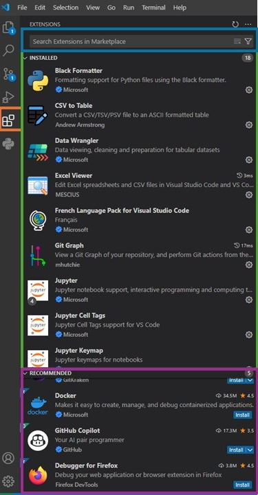
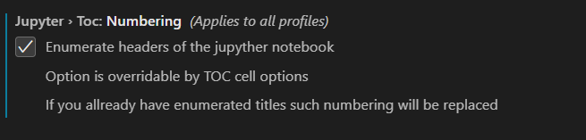
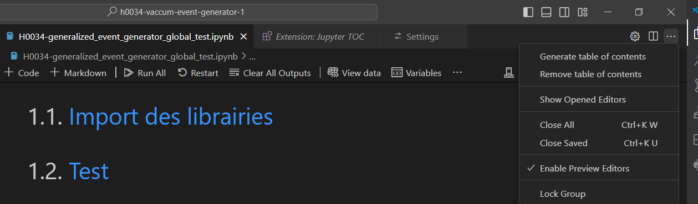

---
⏱️ **Durée estimée :** 40 minutes (lecture + configuration)
📋 **Prérequis :** Installation de VSCode, bases de la programmation
🎯 **Objectifs :** 
- Maîtriser l'interface et les fonctionnalités de VSCode
- Configurer l'environnement pour le développement Python
- Utiliser Git et les outils de versioning intégrés
- Installer et gérer les extensions essentielles

**TL;DR :** Ce chapitre guide la configuration et l'utilisation optimale de Visual Studio Code pour le développement scientifique.
---

# Utiliser l'IDE Visual Studio Code

## Introduction

Visual Studio Code (VSCode) est un éditeur de code puissant et extensible développé par Microsoft. Il offre une multitude de fonctionnalités pour le développement de logiciels, y compris la coloration syntaxique, l'auto-complétion, le débogage, et bien plus encore. Cet éditeur est particulièrement apprécié pour sa flexibilité et son large écosystème d'extensions.

- [Consultez la documentation officielle pour un tutoriel exhaustif sur les fonctionnalités de VSCode dans différents langages, notamment Python.](https://code.visualstudio.com/docs)
- [Documentation sur le contrôle de version avec Git dans VSCode.](https://code.visualstudio.com/docs/sourcecontrol/overview)

## Interface de VSCode

L'interface de VSCode est intuitive et hautement personnalisable, offrant un environnement de travail adapté à vos besoins. Elle se compose de plusieurs zones clés :

- **Barre latérale** : Regroupe l'explorateur de fichiers, les contrôles de version, les extensions, et d'autres fonctionnalités essentielles.
- **Zone de l'éditeur** : Affiche vos fichiers ouverts pour l'édition.
- **Panneau** : Contient les résultats de recherche, la console de débogage, les terminaux intégrés, etc.

## Gestion du Versioning

VSCode intègre de puissantes fonctionnalités de contrôle de version pour Git et d'autres systèmes de gestion de versions. Vous pouvez gérer vos branches, commits, différences, fusions, et bien plus encore, directement depuis l'éditeur, ce qui simplifie grandement le flux de travail en développement.

## Extensions Utiles pour VSCode

VSCode est extrêmement extensible grâce à ses nombreuses extensions disponibles sur le Marketplace. Ces extensions ajoutent des fonctionnalités supplémentaires pour améliorer votre flux de travail.

### Installation des Extensions

Les extensions sont gérées directement depuis l'interface de VSCode. La **zone orange** dans l'image suivante montre où vous pouvez gérer vos extensions.

Il y a trois zones distinctes dans cette interface :

- **Zone bleue** : Permet de rechercher des extensions disponibles sur le Marketplace.
- **Zone verte** : Montre les extensions déjà installées.
- **Zone fuchsia** : Recommande des extensions à installer.

### Extensions Recommandées

#### Python Environment Manager

Python Environment Manager simplifie la gestion des environnements Python dans VSCode. Il vous permet de créer, activer, et gérer facilement des environnements virtuels directement depuis l'éditeur. Grâce à cette extension, vous pouvez :

- Créer de nouveaux environnements virtuels.
- Changer d'environnement Python en quelques clics.
- Configurer automatiquement l'interpréteur Python pour votre projet.

#### Black Formatter

Black Formatter est un outil de formatage de code Python qui applique un style de codage cohérent à vos fichiers. Il formate automatiquement le code selon les standards PEP 8, facilitant ainsi la lisibilité et la maintenance. Les fonctionnalités incluent :

- Formatage automatique du code lors de la sauvegarde.
- Configuration des options de formatage via les paramètres de VSCode.
- Intégration avec les outils de contrôle de version pour appliquer des modifications formatées.

#### CSV to Table

CSV to Table est une extension pratique pour convertir rapidement des fichiers CSV en tableaux HTML ou Markdown, ce qui facilite l'analyse et la présentation des données. Les fonctionnalités incluent :

- Conversion rapide des fichiers CSV en tableaux bien formatés.
- Prévisualisation des données directement dans VSCode.
- Support des fichiers CSV volumineux.

#### Data Wrangler

Data Wrangler est une extension puissante pour les scientifiques des données et les analystes. Elle offre des outils avancés pour manipuler, nettoyer, et visualiser des jeux de données volumineux directement dans VSCode. Les fonctionnalités comprennent :

- Nettoyage et transformation des données avec des opérations simples.
- Visualisation des données à l'aide de graphiques interactifs.
- Exportation des données transformées vers différents formats.

#### Excel Viewer

Excel Viewer permet de visualiser les fichiers Excel directement dans VSCode, sans quitter votre environnement de développement. Les fonctionnalités incluent :

- Affichage des fichiers Excel dans une vue tabulaire.
- Prise en charge des formats XLS et XLSX.
- Navigation facile à travers les feuilles de calcul et les cellules.

#### Git Graph

Git Graph est une extension visuelle qui vous permet de visualiser l'historique Git sous forme graphique. Elle facilite la compréhension des branches, des commits, et des merges. Les fonctionnalités comprennent :

- Visualisation interactive de l'historique Git.
- Gestion des branches et des tags.
- Exécution d'actions Git directement depuis la vue graphique (comme les merges, les rebases, et les cherry-picks).

#### Markdown All in One

Markdown All in One est une extension complète pour travailler avec Markdown dans VSCode. Elle propose des fonctionnalités avancées pour la rédaction, la prévisualisation, et la gestion des fichiers Markdown. Les fonctionnalités incluent :

- Auto-complétion des éléments Markdown.
- Prévisualisation en temps réel des fichiers Markdown.
- Support des tableaux, des diagrammes et des mathématiques en Markdown.
- Raccourcis clavier pour faciliter la rédaction.

#### Jupyter TOC

Jupyter TOC est une extension qui permet de numéroter automatiquement les sections Markdown dans un Notebook Jupyter et de générer une table des matières.

##### Configuration

- Accédez aux options de Jupyter TOC : `File > Preferences > Settings > Extensions > Jupyter TOC`.
- Activez la numérotation (Numbering) comme illustré ci-dessous :

##### Utilisation

Créez la table des matières en cliquant sur *Generate table of contents*, comme montré ci-dessous. La numérotation se met à jour automatiquement en répétant ce processus.

---

