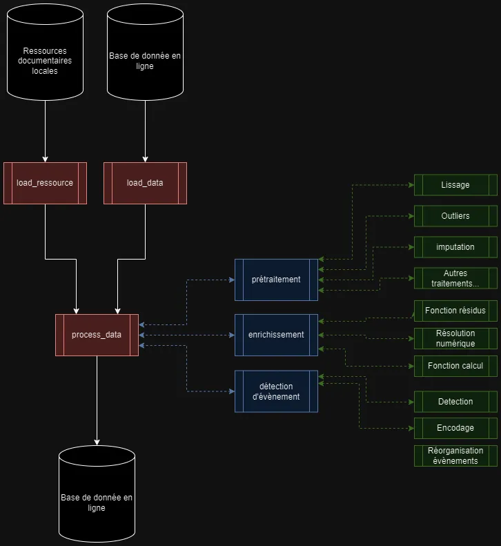

---
⏱️ **Durée estimée :** 35 minutes (lecture + exercice de conception)
📋 **Prérequis :** Bases de la programmation, notions de conception logicielle
🎯 **Objectifs :** 
- Comprendre l'importance de l'architecture logicielle
- Apprendre à décomposer un projet en modules
- Maîtriser la planification des interactions entre composants
- Lier architecture et gestion des tâches de développement

**TL;DR :** Ce chapitre explique comment concevoir l'architecture d'un logiciel avant de programmer pour organiser et faciliter le développement.
---

# L'Importance de Définir l'Architecture d'un Code

Imaginons que vous construisez une maison. Avant même de penser à la peinture des murs ou au style des meubles, vous devez avoir un plan précis : où seront les pièces, comment l'eau et l'électricité seront distribuées, etc. En développement logiciel, définir l'architecture d'un code, c'est un peu comme dessiner ce plan. Cela vous aide à :

1. **Organiser votre projet** : Savoir qui fait quoi, où chaque élément va se trouver, et comment ils vont interagir.
2. **Faciliter les modifications** : Si vous avez besoin d'ajouter une nouvelle fonctionnalité, vous saurez où et comment sans tout chambouler.
3. **Rendre la maintenance plus simple** : Comprendre rapidement où se trouvent les problèmes ou où apporter des améliorations.

# Comment Définir l'Architecture d'un Code

1. **Comprendre le projet** : Avant tout, il est crucial de savoir ce que vous voulez que votre logiciel fasse. Pour notre exemple, cela pourrait être de simuler le comportement d'un procédé industriel sous différentes conditions.
2. **Déterminer les grandes parties** : Divisez votre logiciel en grandes zones fonctionnelles. Par exemple, une partie pour l'entrée des données (comme les réactifs et les conditions de température), une autre pour le cœur de la simulation, et enfin une partie pour afficher les résultats.
3. **Choisir les bons outils** : Sélectionnez les outils et langages qui correspondent le mieux à chaque partie. Pour une simulation industrielle, vous pourriez utiliser un langage de programmation connu pour sa capacité à gérer des calculs complexes.
4. **Planifier les interactions** : Décidez comment ces parties vont communiquer entre elles. Par exemple, comment les données entrées par l'utilisateur seront transmises au moteur de simulation, puis comment les résultats seront affichés.
5. **Tester et ajuster** : Une fois l'architecture définie, commencez par développer une petite partie pour tester si tout fonctionne comme prévu. Utilisez les retours pour ajuster le plan initial si nécessaire.

# Exemple Pratique: Jumeau numérique et détecteur en ligne

Un exemple ici, sur un jumeau numérique de procédé classique (simulateur + détection ).

Chaque partie de ce logiciel doit être conçue pour travailler ensemble de manière fluide. le format des entrées et sorties de chaque partie doit être spécifié en amont.

# Lien entre la Définition de l'Architecture et l'Initialisation de la Liste des Tâches

La définition de l'architecture d'un logiciel et l'initialisation de la liste des tâches avant la programmation sont étroitement liées et se renforcent mutuellement. Voici comment elles interagissent :

1. **Fondation pour la Planification des Tâches** : L'architecture offre un cadre et une vue d'ensemble du système, ce qui est essentiel pour décomposer le projet en tâches spécifiques et gérables.
2. **Identification des Dépendances** : En définissant clairement les composants du système et leurs interactions, il est possible d'identifier les dépendances entre les tâches, ce qui est crucial pour leur séquencement logique.
3. **Allocation des Ressources** : Une compréhension claire de l'architecture aide à allouer les ressources de manière efficace, en associant les développeurs aux tâches qui correspondent à leurs compétences.
4. **Facilitation de la Communication** : Une architecture bien définie facilite la communication au sein de l'équipe projet, en fournissant une langue commune pour les développeurs, gestionnaires de projet, et autres parties prenantes.
5. **Amélioration de l'Estimation du Temps et des Coûts** : La définition de l'architecture permet une meilleure estimation des délais et des coûts du projet, grâce à une meilleure visibilité sur les exigences et les tâches à accomplir.

Chaque tâche est planifiée en tenant compte des dépendances et des compétences nécessaires, facilitant une progression ordonnée et efficace du projet.

# Lien entre architecture et lisibilité du code

Le lien entre l'architecture d'un système logiciel et la lisibilité de son code est un aspect fondamental du génie logiciel qui a un impact direct sur la maintenance, l'évolutivité et la qualité globale du logiciel. Une architecture bien conçue favorise un code organisé, tandis qu'une architecture mal conçue peut mener à un code désordonné et difficile à comprendre. Voici quelques points clés qui illustrent ce lien :

# 1\. **Séparation des préoccupations**

Une architecture efficace divise le système en composants distincts, chacun gérant une préoccupation spécifique. Cette séparation permet d'isoler les fonctionnalités, rendant le code plus lisible et plus facile à gérer. Par exemple, dans une architecture MVC (Modèle-Vue-Contrôleur), la logique métier, l'interface utilisateur et l'interaction avec la base de données sont séparées, ce qui aide à naviguer dans le code et à comprendre rapidement son fonctionnement.

# 2\. **Cohésion et couplage**

- **Cohésion** fait référence à la mesure dans laquelle les responsabilités d'un seul module sont étroitement liées. Une haute cohésion au sein des modules signifie que le code est bien organisé et concentré sur une seule tâche ou préoccupation, ce qui améliore la lisibilité et la maintenabilité.
- **Couplage** décrit comment les différents modules sont dépendants les uns des autres. Un couplage faible entre les modules signifie que les changements dans un module ne nécessitent pas ou peu de changements dans les autres, facilitant ainsi la compréhension et la modification du code.

# 3\. **Conventions et standards**

Une bonne architecture s'appuie sur des conventions et des standards bien établis, tels que le nommage des composants, les structures de données à utiliser, et les patterns de conception. L'adoption de ces conventions à travers le codebase assure une cohérence qui rend le code plus prévisible et plus facile à lire. (voir [Comment rédiger un beau code python ?](beautiful_code_pep8.md))

# 4\. **Documentation**

L'architecture d'un système inclut souvent des artefacts tels que des diagrammes d'architecture et de la documentation technique, qui aident à comprendre la structure globale et le flux du système. Ces ressources sont vitales pour maintenir la lisibilité du code, surtout pour les nouveaux développeurs rejoignant le projet ou lorsqu'on revient sur d'anciens composants après une longue période.

# 5\. **Tests et refactorisation**

Une architecture solide facilite une stratégie de test cohérente et la refactorisation continue du code. Les tests unitaires et d'intégration peuvent être plus facilement écrits et maintenus lorsque le code suit une structure claire et des principes de conception solides. De même, une bonne architecture rend la refactorisation moins risquée et plus efficace, contribuant ainsi à la lisibilité et à l'amélioration continue du code.

# Conclusion

En résumé, l'architecture d'un logiciel joue un rôle crucial dans la lisibilité du code. Une bonne architecture facilite la navigation dans le code, permet une meilleure compréhension de la logique métier et réduit le coût de maintenance. Les développeurs doivent donc porter une attention particulière à la conception architecturale dès le début d'un projet et tout au long de son cycle de vie pour s'assurer que le code reste propre, lisible et maintenable.