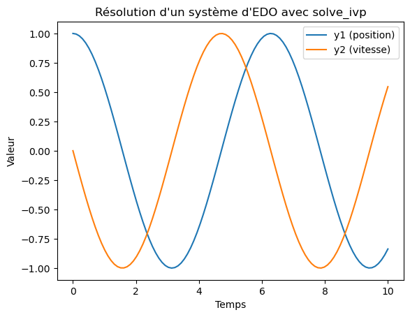

---
⏱️ **Durée estimée :** 60 minutes (lecture + pratique)
📋 **Prérequis :** Python, NumPy, SciPy, équations différentielles de base
🎯 **Objectifs :** 
- Maîtriser la résolution d'EDO avec SciPy
- Comprendre les différentes méthodes numériques
- Implémenter des systèmes d'EDO complexes
- Analyser et visualiser les solutions

**TL;DR :** Ce chapitre détaille la résolution pratique des systèmes d'équations différentielles ordinaires avec Python.
---

# Résolution d'un Système d'Équations Différentielles Ordinaires en Python

## Introduction

Les systèmes d'équations différentielles ordinaires (EDO) sont essentiels pour modéliser divers phénomènes naturels et techniques, tels que la dynamique des systèmes mécaniques, les circuits électriques, les réactions chimiques, et bien plus. Python, avec ses bibliothèques puissantes comme SciPy et SymPy, offre des outils robustes pour résoudre ces systèmes de manière efficace.

## Méthodes Disponibles

### SciPy: `solve_ivp`

La bibliothèque SciPy offre une fonction puissante, `solve_ivp`, pour résoudre les systèmes d'EDO. Cette fonction permet de choisir parmi plusieurs méthodes de résolution, telles que Runge-Kutta, LSODA, etc.

### SymPy: Approche Symbolique

SymPy permet de manipuler et de résoudre symboliquement les EDO, offrant ainsi une flexibilité pour les analyses théoriques et la vérification des solutions.

## Exemples de Code

### 1. Utilisation de `solve_ivp` de SciPy

Voici un exemple illustrant la résolution d'un système d'EDO avec `solve_ivp` :

```python
import numpy as np
from scipy.integrate import solve_ivp
import matplotlib.pyplot as plt

# Définir le système d'équations différentielles
def system(t, y):
    dydt = [y[1], -y[0]]
    return dydt

# Conditions initiales
y0 = [1, 0]

# Intervalle de temps
t_span = (0, 10)
t_eval = np.linspace(t_span[0], t_span[1], 100)

# Résoudre le système
solution = solve_ivp(system, t_span, y0, t_eval=t_eval)

# Afficher les résultats
plt.plot(solution.t, solution.y[0], label='y1 (position)')
plt.plot(solution.t, solution.y[1], label='y2 (vitesse)')
plt.xlabel('Temps')
plt.ylabel('Valeur')
plt.legend()
plt.title('Résolution d\'un système d\'EDO avec solve_ivp')
plt.show()
```

  {width="194" height="154"}

### 2. Utilisation de SymPy pour une Approche Symbolique

SymPy permet de résoudre symboliquement des EDO. Voici comment :

```python
import sympy as sp

# Définir les variables et fonctions
t = sp.symbols('t')
y1 = sp.Function('y1')(t)
y2 = sp.Function('y2')(t)

# Définir les équations différentielles
eq1 = sp.Eq(y1.diff(t), y2)
eq2 = sp.Eq(y2.diff(t), -y1)

# Résoudre les équations
solution = sp.dsolve((eq1, eq2))

# Afficher les solutions
sp.pprint(solution)
```

## Choix de la Méthode

### Méthodes Numériques

- **Avantages** : Efficaces pour les systèmes complexes, adaptatives, nombreuses options de méthodes.
- **Inconvénients** : Précision dépendante de la méthode et des paramètres, nécessite des conditions initiales.

### Méthodes Symboliques

- **Avantages** : Fournit des solutions exactes, utile pour l'analyse théorique.
- **Inconvénients** : Peut être limitée pour les systèmes très complexes ou non linéaires.

## Conclusion

Python, avec ses bibliothèques SciPy et SymPy, fournit des outils puissants pour résoudre des systèmes d'équations différentielles ordinaires, que ce soit de manière numérique ou symbolique. La méthode choisie dépend des besoins spécifiques du problème à résoudre, des préférences pour l'analyse numérique ou symbolique, et des ressources disponibles. Avec ces outils, même les systèmes d'EDO complexes peuvent être abordés avec précision et efficacité.

## Références

- [Documentation de SciPy pour solve_ivp](https://docs.scipy.org/doc/scipy/reference/generated/scipy.integrate.solve_ivp.html#scipy.integrate.solve_ivp)
- [Documentation de SimPy](https://simpy.readthedocs.io/en/latest/)
